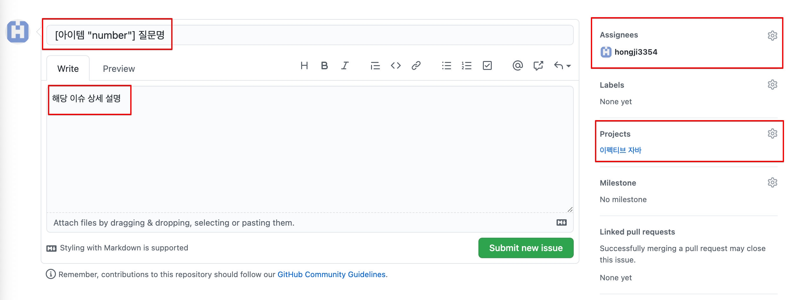

# 이펙티브 자바 

## 스터디 방법

- 기본적으로 스터디는 매주 진행한다.
- 아이템 마다 분량과 난이도가 다르므로, 스터디시 다음 주차에 진행할 분량과 리딩할 사람을 정한다.
- 스터디를 진행하기 이틀전까지 모든 사람이 해당 주에 진행할 아이템의 내용을 정리하여 github에 올린다.
  - 아래 예제처럼 해당 item 안에 자신의 이름을 한 프로젝트를 생성하여 해당 프로젝트에 내용을 정리해서 올린다.
    - [예제](https://github.com/java-starter/ReadingBooks/tree/main/effective-java/item99) 참고
- 책을 읽으면서 궁금하거나 모르는 점은 Issue로 등록하여 협력을 통해 해결한다.
  - 기본적으로 Issue에 대해 답변은 해당 주차의 리딩이 담당한다. (다른 사람이 답변해도 된다.)
  - 스터디 시간 전까지 리딩하는 사람은 해당 이슈에 답변을 달고 스터디 시간에 함께 살펴본다. 모두가 납득하면 close 한다.
  - 해결하지 못한 이슈는 stuck 처리한다.

## 이슈생성 방법

- 이슈 생성은 아래와 같은 규칙으로 생성한다.
- Assignees는 현재 리딩하는 사람을 지정한다.
- Project는 이펙티브 자바를 지정한다.

