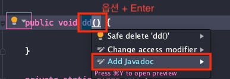
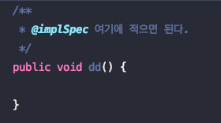

## 상속을 고려한 설계와 문서화

상속을 고려한 설계와 문서화란 메서드를 재정의하면 어떤 일이 일어나는지를 정확히 정리하여 문서로 남겨야 한다는 말이다. **상속용 클래스는 재정의할 수 있는 메서드들을 내부적으로 어떻게 이용하는지(자기사용) 문서로 남겨야 한다.**

예를 들어 <u>HashSet의 클래스</u>를 상속한다고 가정하자. HashSet의 addAll()은 자기의 메서드인 add() 메서드를 이용한다.


이렇게 클래스의 API로 공개된 메서드에서 클래스 자신의 또다른 메서드를 호출할 수도 있다. 그런데 마침 호출되는 메서드가 재정의 가능 메서드라면 그 사실을 호출하는 메서드의 API 설명에 적시해야 한다. 

- 어떤 순서로 호출하는지?
- 각각의 호출 결과가 이어지는 처리에 어떤 영향을 주는지?

## 문서화를 도와주는 @implSpec

API 문서의 메서드 설명 끝에서 종종 "Implementation Requirements"로 시작하는 절을 볼 수 있는데, 그 메서드의 내부 동작 방식을 설명하는 곳이다. 이 절은 메서드 주석에 @implSpec 태그를 붙여주면 자바독 도구가 생성 해준다.

다음은 AbstactCollection에 있는 remove 함수의 예이다.


명세서를 보면 내부적으로 iterator의 remove 메서드를 사용하고 있으며, iterator.remove()를 구현하지 않을 경우 UnsupportedOperationException이 발생한다고 나와 있다.

하지만 이런 식의 문서는 **"좋은 API문서란 '어떻게'가 아닌 '무엇을'을 하는지를 설명해야 한다"** 라는 말과 대치된다. 어쩔 수 없이 상속이 캡슐화를 해치기 때문에 일어나는 안타까운 현실이다. 클래스를 안전하게 상속할 수 있도록 하려면 내부 구현 방식을 설명해야 한다.

@implSepc은 자바 8부터 처음 도입되어 자바 9부터 본격적으로 사용되기 시작했다. 이 어노테이션이 무조건 사용해야되도록 기본값으로 활성화 되어있어야한다고 생각하지만, 아직까지도 선택사항으로 남아있다. 


### @implSepc 작성하는 방법





## protected hook 메서드

또 다른 예로 하위 클래스의 성능향상을 위해 클래스의 내부 동작 과정에 끼어 들 수 있는 훅(hook) 메서드를 만들어 proected 메서드로 제공해야 할수 도 있다. 아니면 protected 필드로 공개해야 할 수도 있다.

java.util.AbstarctList의 removeRange를 살펴보자.


Implementation Requirements : 이 메서드는 fromIndex에서 시작하는 리스트 반복자를 얻어 모든 원소를 제거할 때까지 ListIterator.next와 ListIterator.remove를 반복 호출하도록 구현되어 있다. 주의 : ListInterator.remove가 선형 시간이 걸리면 이 구현의 성능은 제곱에 비례 한다.

List 구현체를 사용하는 클라이언트 입장에서는 removeRange 메서드에는 관심이 없다. 그럼에도 불구하고 이 메서드를 제공한 이유는 **clear 메서드를 최적화할 수 있기 때문이다.** removeRange 메서드가 없었다면 하위 클래스에서 clear 메서드가 호출이 되면 제곱에 비례해 성능이 느려지거나, 밑바닥 부터 새로 구현 했어야 했다.


이런 메서드들을 protected hook 메서드라고 한다.

그렇다면 상속용 클래스를 설계할 때 어떤 메서드를 protected로 노출해야 할지는 어떻게 결정할까? 안타깝게도 마법은 없다. 심사숙고해서 잘 예측해본 다음, 실제 하위 클래스를 만들어 시험해보는 것이 최선이다. protected 메서드 하나하나가 내부 구현에 해당하므로 그 수는 가능한 적어야 한다. 한편으로는 너무 적게 노출해서 상속으로 얻는 이점마저 없애지 않도록 주의해야 한다. 

## 상속용 클래스 설계

**상속용 클래스를 시험하는 방법은 직접 하위 클래스를 만들어보는 것이 유일하다.** 적어도 하위 클래스 3개 정도는 만들어 봐야하며, 이 중 하나 이상은 제3자가 작성해보면 좋다. 

또한 널리 쓰일 클래스를 상속용으로 설계한다면 개발자가 문서화한 내부 사용 패턴(자기사용)과 protected 메서드와 필드를 구현하면서 선택한 결정에 영원히 책임을 져야 한다. 이 결정들이 그 클래스의 성능과 기능에 영원한 족쇄가 될 수 있다. **그러니 상속용으로 설계한 클래스는 배포 전에 반드시 하위 클래스를 만들어 검증해야 한다.**

그리고 **상속용 클래스의 생성자는 직접적으로든 간접적으로든 재정의 가능 메서드를 호출해서는 안된다.**

**Super.java**

```java
public class Super {
	public Super() {
    overrideMe();
  }
  
  public void overrideMe() {}
}
```

**Sub.java**

```java
public final class Sub extends Super{
    private final Instant instant;

    public Sub() {
        this.instant = Instant.now();
    }

    @Override
    public void overrideMe() {
        System.out.println(instant);
    }

     public static void main(String[] args) {
          Sub sub = new Sub();
          sub.overrideMe();
      }
}
```

이 코드를 실행하면 다음의 결과를 얻는다.

```
null
2021-02-13T14:23:46.752926Z
```

이 결과가 나오는 이유는 상위 클래스의 생성자는 하위 클래스의 생성자가 인스턴스 필드를 초기화하기도 전에 overrideMe를 호출하기 때문이다. 

### Cloneable, Serializable

Cloneable과 Serializable 인터페이스는 상속용 설계의 어려움은 한층 더해준다. 둘 중 하나라도 상속할 클래스에서 implements 해주는건 일반적으로 좋지 않다. 그 클래스를 확장하려는 개발자에게 엄청난 부담이기 때문이다.

원한다면 HashSet처럼 하위 클래스에서 따로 구현하는 방법이 있다. 

clone과 readObject 메서드는 생성자와 비슷한 효과를 낸다. 따라서 상속용 클래스에서 Cloneable이나 Serializable을 구현할지 정해야 한다면, 이들을 구현할 때 따르는 제약도 생성자와 비슷하다는 점에 주의하자. **즉, clone과 readObject 모두 직접적으로든 간접적으로든 재정의 가능 메서드를 호출해서는 안 된다.** readObject의 경우 하 위 클래스의 상태가 미처다 역직렬화되기 전에 재정의한 메서드부터 호츨하게 된다. clone의 경우 하위 클래스의 clone 메서드가 복제본의 상태를 수정하기 전에 새정의한 메서드를 호출한다. 어느 쪽이든 프로그램 오작동으로 이어질 것이다.

마지막으로 Serializable을 구현한 상속용 클래스가 readResolve나 writeReplace 메서드를 갖는다면 이 메서드는 private이 아닌 protected로 선언해야 한다. private으로 선언한다면 하위 클래스에서 무시가 된다.

## 일반적인 클래스

일반적인 구체 클래스는 어떨까? 전통적으로 이런 클래스는 final도 아니고 상속용으로 설계되거나 문서화되지도 않았다. 하지만 그대로 두면 클래스에 변화가 생길 때마다 하위 클래스를 오동작하게 만들 수 있기 때문에 위험하다.

**이 문제를 해결하는 가장 좋은 방법은 상속용으로 설계하지 않은 클래스는 상속을 금지하는 것이다.** 상속을 금지하는 방법은 두가지 인데, 클래스를 final로 선언하거나, 생성자를 private으로 만든 후 정적팩터리를 만들어 주는 방법이다.

## 정리

상속용 클래스를 설계하기란 힘이 많이 든다. 클래스 내부에서 스스로 어떻게 사용하는지 모두 문서로 남겨야 하며, 일단 문서화한 것은 그 클래스가 쓰이는 한 반드시 지켜야 한다. 그렇지 않으면 그 내부 구현 방식을 믿고 활용하던 하위 클래스는 오동작하게 만들 수 있다. 다른 이가 효율 좋은 하위클래스를 만들 수 있도록 일부 메서드를 protected로 제공해야 할 수도 있다. 그러니 클래스를 확장해야 할 명확한 이유가 떠오르지 않으면 상속을 금지하는 편이 나을 것이다.