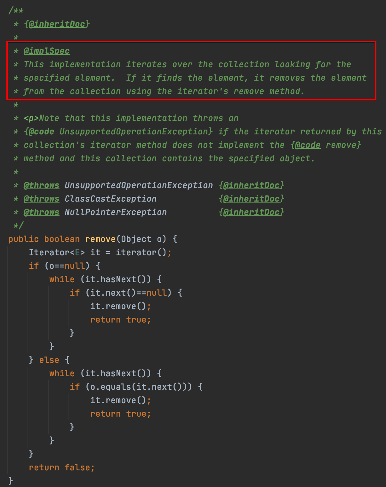
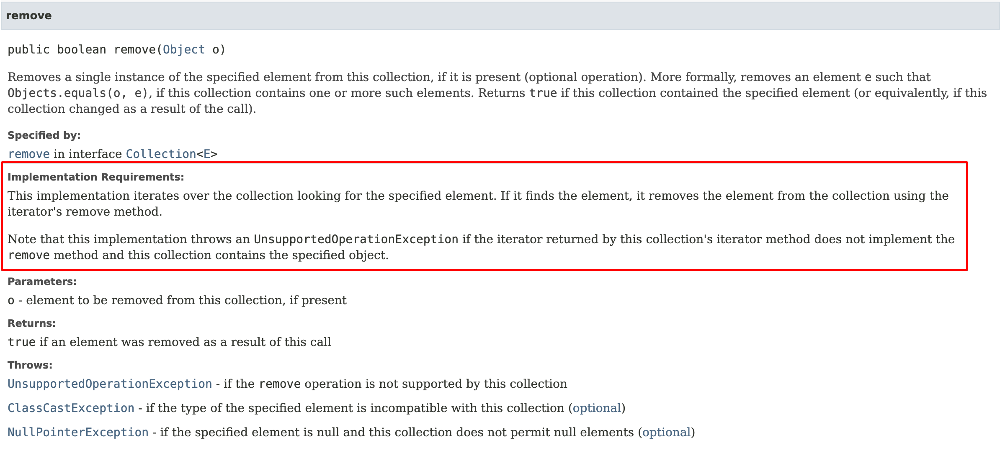
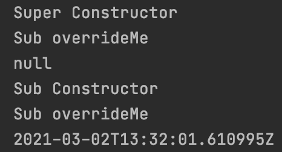
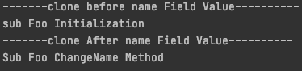
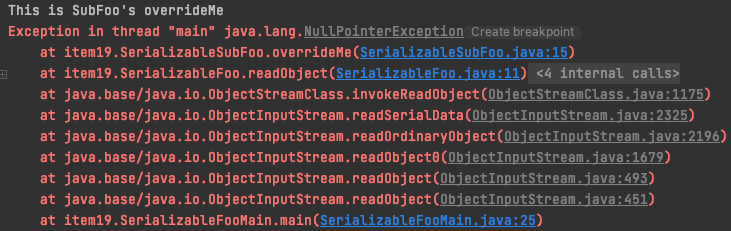
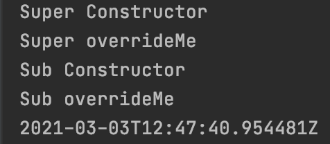

# 아이템 19. 상속을 고려해 설계하고 문서화하라. 그러지 않았다면 상속을 금지하라

# 1. 상속을 고려한 설계와 문서화란?

상속을 고려한 설계와 문서화란 **상속용 클래스에서 재정의할 수 있는 메서드들을 내부적으로 어떻게 이용하는지(자기사용) 문서로 명시**한 것이다.

상속용 클래스에서 재정의할 수 있는 메서드들을 내부적으로 어떻게 이용하는지(자기사용) 명시해야하는 이유는 아래와 같다.

HashSet에서 addAll() 메서드를 호출하면 AbstractCollection의 addAll() 메서드를 사용하며, addAll() 메서드 내부에서는 add() 메서드를 사용해서 요소를 하나씩 추가한다. add() 메서드는 HashSet에 재정의 되어있으며, public 이기 때문에 오버라이딩이 가능하다.

만약 프로그래머가 add() 메서드의 성능을 높이기 위해 HashSet을 상속받아서 add() 메서드를 재정의하면 AbstractCollection의 addAll() 메서드도 영향을 받기 때문에, 문서화를 통해 문제를 방지할 수 있어야 한다.

# 2. @implSpec 태그

@implSpec 태그는 자바8에 등장한 태그로 **해당 메서드의 내부 동작 방식을 설명하기 위해 사용**된다.

AbstractCollection클래스의 remove() 메서드를 보면 @implSpec에서 해당 메서드의 내부동작방식을 설명하고 있다.



위의 주석을 JavaDoc으로 생성하면 아래 API 문서 처럼 생성이 되며, @implSpec 태그 부분이 문서의 Implementation Requirements로 생성된다.



JavaDoc을 만들 때 @implSpec 태그를 활성화 하려면 명령형 매개변수로 `-tag "implSpec:a:Implementation Requirements:` 지정해 줘야 한다.

# 3. 내부 동작 과정 중간에 끼어들 수 있는 hook 메서드

효율적인 하위 클래스를 큰 어려움 없이 만들 수 있게 하려면 클래스의 내부 동작 과정 중간에 끼어들 수 있는 훅(hook)을 잘 선별하여 protected 메서드 형태로 공개해야 할 수도 있다.
예를들어 AbstractList에 있는 clear() 메서드는 removeRange 내부에서 호출하고 있다. 이유는 하위 클래스에서 List의 내부 구조 이점을 잘 활용해서 removeRange 메서드를 잘 활용한다면 clear 메서드의 성능을 향상할 수 있기 때문이다.

ArrayList 안에 있는 SubList가 이렇게 구현되어 있다.
SubList는 AbstractList를 상속받으며 자신의 List 구조에 맞게 removeRange 메서드를 재정의해서 사용하고 있다.

# 4. 상속 클래스 생성시 유의사항

## 4-1. 상속용 클래스의 생성자는 재정의 가능 메서드를 호출해서는 안된다.

하위 클래스에서 상속용 클래스의 재정의 가능 메서드를 오버라이드 하고, 상속용 클래스의 생성자에서 재정의 가능 메서드를 사용하고 있을 시 **하위 클래스에서 오버라이드 한 메서드를 사용하기 때문에 문제가 발생**할 수 있다.

### 4-1-1. 예제

Sub는 Super를 상속받아서 overrideMe 메서드를 오버라이딩 했으며, Super 클래스의 생성자에서는 overrideMe 메서드를 호출한다.

```java
public class Super {
    public Super() {
        System.out.println("Super Constructor");
        overrideMe();
    }

    public void overrideMe() {
        System.out.println("Super overrideMe");
    }
}

public final class Sub extends Super {

    private final Instant instant;

    public Sub() {
        System.out.println("Sub Constructor");
        this.instant = Instant.now();
    }

    @Override
    public void overrideMe() {
        System.out.println("Sub overrideMe");
        System.out.println(instant);
    }

    public static void main(String[] args) {
        Sub sub = new Sub();
        sub.overrideMe();
    }
}
```

시간이 아닌 null이 출력된 이유는 Super 클래스의 생성자에서 Sub 클래스에서 오버라이드한 overrideMe() 메소드를 호출하는데, Sub 클래스의 생성자는 아직 호출되지 않아서 인스턴스 필드가 초기화 되지 않았기 때문이다.



NPE가 발생하지 않은 이유는 println이 null도 입력으로 받아들이기 때문이다.

## 4-2. Cloneable과 Serializable

Clone과 readObject 모두 직접적으로든 간접적으로든 재정의 가능 메서드를 호출해서는 안 된다.

- clone의 경우 하위 클래스의 clone 메서드가 복제본의 상태를 수정하기 전에 재정의한 메서드를 호출한다. 특히 clone이 잘못되면 복제본뿐 아니라 원본 객체에도 피해를 줄 수 있다.
- readObject의 경우 하위 클래스의 상태가 미처 다 역직렬화되기 전에 재정의한 메서드부터 호출하게 된다.

### 4-2-1. Cloneable 예제

CloneableFoo 클래스의 clone 메서드에서 재정의 가능한 메서드인 changeName 메서드를 호출하고 있다.

```java
public class CloneableFoo implements Cloneable{

    private String name;

    public String getName() {
        return name;
    }

    public void changeName(){
        this.name = "Super Foo ChangeName Method";
    }

    @Override
    protected Object clone() throws CloneNotSupportedException {
        changeName();
        return super.clone();
    }
}

public class CloneableSubFoo extends CloneableFoo {

    private String name;

    @Override
    public String getName() {
        return name;
    }
    @Override
    public void changeName(){
        this.name = "Sub Foo ChangeName Method";
    }
    @Override
    protected Object clone() throws CloneNotSupportedException {
        return super.clone();
    }
}

public class Main {

    public static void main(String[] args) throws Exception {
        CloneableSubFoo subFoo = new CloneableSubFoo();
        subFoo.setName("sub Foo Initialization");
        System.out.println("-------clone before name Field Value----------");
        System.out.println(subFoo.getName());

        CloneableSubFoo cloneableSubFoo = (CloneableSubFoo) subFoo.clone();
        System.out.println("-------clone After name Field Value----------");
        System.out.println(cloneableSubFoo.getName());
    }
}
```

CloneableSubFoo 객체에서 name field의 값이 sub Foo Initialization일 때 clone을 호출해서 객체를 복사 했는데, 복사 후의 값이 Sub Foo ChangeName Method로 변경되었다.

그 이유는 CloneableSubFoo의 clone 메서드에서 super.clone  호출하고, 호출된 CloneableFoo의 clone 메서드 에서는 changeName 메서드를 호출하기 때문이다.
CloneableFoo에 있는 changeName 메서드는 CloneableSubFoo에서 재정의 되어서  Super Foo ChangeName Method가 아닌 Sub Foo ChangeName Method가 출력되었다.



### 4-3-2. Serializable 예제

```java
public class SerializableFoo implements Serializable {

    private void readObject(ObjectInputStream ois) throws IOException, ClassNotFoundException {
        ois.defaultReadObject();
        overrideMe();
    }

    public void overrideMe() {
        System.out.println("This is SuperFoo's overrideMe");
    }
}

public class SerializableSubFoo extends SerializableFoo {

    String str;

    public void setStr(String str) {
        this.str = str;
    }

    @Override
    public void overrideMe() {
        System.out.println("This is SubFoo's overrideMe");
        if (str == null) {
            throw new NullPointerException();
        }
        System.out.println(str);
    }
}

public class SerializableFooMain {

    public static void main(String[] args) throws IOException, ClassNotFoundException {
        SerializableSubFoo subFoo = new SerializableSubFoo();
        subFoo.setStr("hi!!!!");

        //직렬화
        byte[] serializedFoo;
        try (ByteArrayOutputStream baos = new ByteArrayOutputStream()) {
            try (ObjectOutputStream oos = new ObjectOutputStream(baos)) {
                oos.writeObject(subFoo);
                serializedFoo = baos.toByteArray();
            }
        }

        // 역직렬화
        byte[] deserializedMember = Base64.getDecoder().decode(Base64.getEncoder().encodeToString(serializedFoo));
        try (ByteArrayInputStream bais = new ByteArrayInputStream(deserializedMember)) {
            try (ObjectInputStream ois = new ObjectInputStream(bais)) {
                Object objectMember = ois.readObject();
				  SerializableSubFoo deserialized = (SerializableSubFoo) objectMember;
            }
        }
    }
}
```

SerializableSubFoo 클래스 역직렬화시 SerializableFoo 클래스에 정의된 readObject 메서드가 호출되고, 해당 메서드에서는 overrideMe 메서드를 호출한다.
SerializableSubFoo 클래스는 SerializableFoo를 상속받아서 overrideMe 메서드를 재정의했기 때문에 SerializableSubFoo의 overrideMe 메서드가 호출되며, 아직 역직렬화가 모두 되지 않아서 변수 str의 값이 없기 때문에 NPE가 발생하는 것이다.



# 5. 일반적인 구체 클래스는 어떻게 해야할까?

상속용으로 설계하지 않은 클래스는 상속을 금지하는 것이 좋다.
상속을 금지 하는 방법은 두 가지다.

1. 클래스를 final로 선언하는 방법
2. 모든 생성자를 private나 default로 선언하고, public static factory method를 만들어 주는 방법

# 6. 재정의 가능 메서드를 제거할 수 있는 방법

1. 각각의 재정의 기능 메서드는 자신의 본문 코드를 private '도우미 메서드'로 옮긴 뒤, 이 도우미 메서드를 호출하도록 수정한다.
2. 재정의 가능 메서드를 호출하는 다른 코드들도 모두 이 도우미 메서드를 호출하도록 수정한다.

상속용 클래스의 생성자는 재정의 가능 메서드를 호출하면 안된다의 예제 코드이다.

```java
public class Super {
    public Super() {
        System.out.println("Super Constructor");
        overrideMe();
    }

    public void overrideMe() {
        System.out.println("Super overrideMe");
    }
}

public final class Sub extends Super {

    private final Instant instant;

    public Sub() {
        System.out.println("Sub Constructor");
        this.instant = Instant.now();
    }

    @Override
    public void overrideMe() {
        System.out.println("Sub overrideMe");
        System.out.println(instant);
    }

    public static void main(String[] args) {
        Sub sub = new Sub();
        sub.overrideMe();
    }
}

```

재정의 가능 메서드를 제거할 수 있는 방법을 적용해서 리팩토링 하면 아래와 같이 변경된다.

```java
public class Super {
    public Super() {
        System.out.println("Super Constructor");
        helperMethod();
    }

    public void overrideMe() {
        helperMethod();
    }

    private void helperMethod(){
        System.out.println("Super overrideMe");
    }
}

public final class Sub extends Super {

    private final Instant instant;

    public Sub() {
        System.out.println("Sub Constructor");
        this.instant = Instant.now();
    }

    @Override
    public void overrideMe() {
        System.out.println("Sub overrideMe");
        System.out.println(instant);
    }

    public static void main(String[] args) {
        Sub sub = new Sub();
        sub.overrideMe();
    }
}

```

