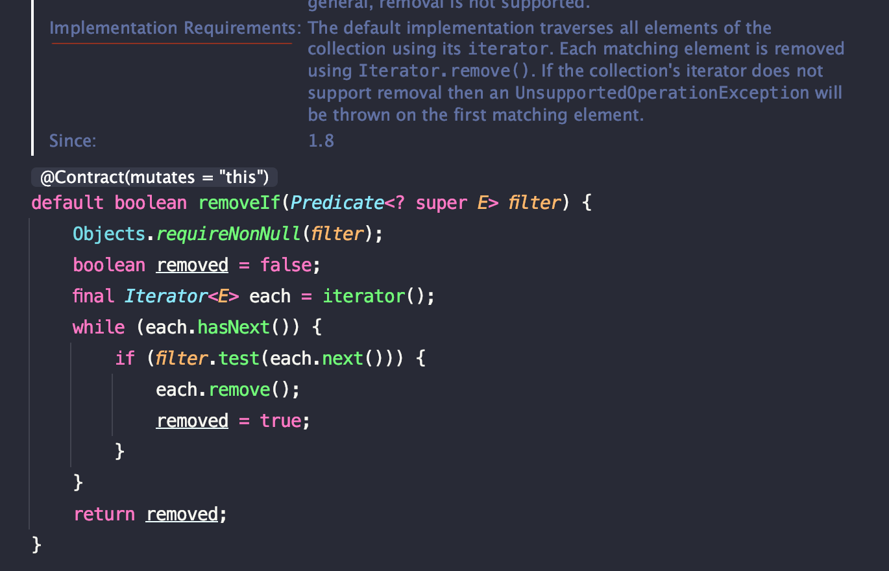

자바가 제공하는 다중 구현 메커니즘에는 **인터페이스**와 **추상클래스**가 있다. 자바 8부터는 인터페이스도 디폴트 메서드를 제공하기 때문에, 인터페이스도 내부에 인스턴스 메서드를 가질 수 있다. 둘의 가장 큰 차이점은 추상 클래스를 구현한 클래스는 반드시 추상클래스의 하위 클래스가 되어야 한다는 점이다. **반면에 인터페이스 경우 인터페이스가 선언한 메서드를 모두 정의하고 그 일반 규약을 잘 지킨 클래스라면 다른 어떤 클래스를 상속했든 같은 타입으로 취급된다.**

기존 클래스에도 손쉽게 새로운 인터페이스를 구현해넣을 수 있다. 인터페이스가 요구하는 메서드를 추가하고, 클래스 선언에 implements 구문만 추가하면 끝이다. 반면 기존 클래스가 같은 추상 클래스를 확장하길 원한다면, 그 추상 클래스는 계층구조상 두 클래스의 공통 조상이어야 한다. 안타깝게도 이 방식은 클래스 계층구조에 커다란 혼란을 일으킨다. 새로 추가된 추상 클래스의 모든 자손이 이를 상속하게 되는 것이다. 그렇게 하는 것이 적절하지 않은 상황에서도 강제로 말이다.

## 믹스인(mixin)

**인터페이스는 믹스인 정의에 안성맞춤이다.** 믹스인이란 클래스가 구현할 수 있는 타입으로, 믹스인을 구현한 클래스에 원래의 주된 타입 외에도 특정 선택적 행위를 제공한다고 선언하는 효과를 준다.  예컨대 Comparable은 자신을 구현한 클래스의 인스턴스들끼리는 순서를 정할 수 있다고 선언하는 믹스인 인터페이스다. 추상 클래스로는 믹스인을 정의할 수 없다. 이유는 앞서와 같이, 기존 클래스 계층구조에는 믹스인을 삽입하기에 합리적인 위치가 없기 때문이다.

> 과연 Comparable이 믹스인 인터페이스 일까? 여기서 저자는 Comparable이 믹스인 인터페이스라고 주장하고 있다. 그러나 믹스인이 되기 위한 조건이 몇가지 있다.
>
> - 다중상속이 가능할 것
> - 메소드의 구현 작성이 되있어야 할 것
>
> JDK8 이전에는 메소드의 구현을 하위클래스에서 재사용하기 위해서는 구현 클래스나, 추상 클래스를 이용할 수 밖에 없었다.  그러나 자바는 단일상속밖에 지원되지 않으므로, 인터페이스를 사용할 수 밖에 없었다. 그러나 인터페이스는 메서드의 선언만 할 수 있을 뿐, 직접 구현은 그 인터페이스를 상속한 하위클래스에서 해야하는 제약조건이 있었다. 이런 제약조건 때문에 자바에서는 메서드의 선언만 있는 Comparable 클래스도 믹스인 인터페이스라고 한 것 같다. 
>
> 언어적인 한계를 넘어서 Comparable 클래스를 본다면 믹스인이 아니다.
>
> 그러나 JDK 8 부터는 디폴트 메서드의 기능이 등장하면서 인터페이스에서도 기본 구현을 할 수 있게 되어 완전한 믹스인을 사용할 수 있게 되었다.


## 디폴트 메서드(default method)

인터페이스 메서드 중 구현 방법이 명백한 것이 있다면, 그 구현을 디폴트 메서드로 제공하는 것이 좋다. 이 방식을 사용한 예로는 Collection.removeIf 메서드가 있다. 



디폴트 메서드를 제공할 때는 위와 같이 @implSpec 자바독 태그를 붙여 문서화 해야 한다.

디폴트 메서드에도 제약은 있다. 많은 인터페이스가 equals와 hashCode 같은 Object의 메서드를 정의하고 있지만, 이들은 디폴트 메서드로 제공해서는 안 된다. 또한 인터페이스는 인스턴스 필드를 가질 수 없고(추상 클래스와 차이) public이 아닌 정적 멤버도 가질 수 없다. 마지막으로 내가 만들지 않은 인터페이스에는 디폴트 메서드를 추가할 수 없다. 


## 추상 골격 구현(skeletal implementation)

인터페이스와 추상 골격 구현 클래스를 함께 제공하는 식으로 인터페이스와 추상 클래스의 장점을 모두 취하는 방법도 있다. 인터페이스로는 타입을 정의하고, 필요하면 디폴트 메서드 몇 개도 함께 제공한다. 그리고 골격 구현 클래스는 나머지 메서드들까지 구현한다. 이렇게 해두면 단순히 골격 구현을 확장하는 것만으로 이 인터페이스를 구현하는 데 필요한 일이 대부분 완료된다. 이것이 바로 [템플릿 메서드 패턴](https://donghyeon.dev/design%20pattern/2020/04/27/%ED%85%9C%ED%94%8C%EB%A0%88%EC%9D%B4%ED%8A%B8-%ED%8C%A8%ED%84%B4/)이다.

이 예제로는 List 인터페이스를 구현한 AbstractList가 추상 골격 구현 클래스가 된다.

실제로 골격 구현을 제대로 설계하면 그 인터페이스로 나름의 구현을 만들려고 하는 개발자의 일이 상당히 덜어준다.

다음은 List 구현체를 반환하는 정적 팩터리 메서드인데, AbstractList 추상 골격 구현을 이용하여 구현체를 반환한다.

**IntListHelper.*intArrayAsList()***

```java
public interface IntListHelper {
    
    static List<Integer> intArrayAsList(int[] a) {
        return new AbstractList<Integer>() {
            @Override
            public Integer get(int index) {
                return a[index];
            }

            @Override
            public int size() {
                return a.length;
            }
        };
    }
}
```

이렇게 List 구현체를 만들고 싶을 때 추상 골격 구현을 이용하면 List 인터페이스에 있는 모든 메서드를 구현하지 않아도 되기 때문에 개발자의 일을 상당히 줄여 준다. 위에 있는 코드는 [어댑터 패턴](https://donghyeon.dev/design%20pattern/2020/02/11/%EC%96%B4%EB%8C%91%ED%84%B0-%ED%8C%A8%ED%84%B4/)이라고도 부른다.

### 골격 구현 작성법

가장 먼저, 인터페이스를 잘 살펴 다른 메서드들의 구현에 사용되는 기반 메서드들을 선정한다. 이 기반 메서드들은 골격 구현에서는 추상 메서드가 될 것이다. 그다음으로, **기반 메서드들을 사용해 직접 구현할 수 있는 메서드를 모두 디폴트 메서드로 제공한다.** 단, equals와 hashCode 같은 Object의 메서드는 디폴트 메서드로 제공하면 안 된다. 만약 인터페이스의 메서드 모두가 기반 메서드와 디폴트 메서드가 된다면 골격 구현 클래스를 별도로 만들 이유는 없다. 기반 메서드나 디폴트 메서드로 만들지 못한 메서드가 남아 있다면, 이 인터페이스를 구현하는 골격 구현 클래스를 하나 만들어 남은 메서드들을 작성해 넣는다. 골격 구현 클래스에는 필요하면 public이 아닌 필드와 메서드를 추가해도 된다.

## 네이밍 컨벤션

관례상 인터페이스 이름이 Interface라면 골격 구현 클래스 이름은 **AbstractInterface**라고 짓는다. 좋은 예로 컬렉션 프레임워크의 AbstractCollection, AbstractSet, AbstractList, AbstractMap 이 컬렉션 인터페이스의 골격 구현이다. 

## 정리

골격 구현은 기본적으로 상속해서 사용하는 걸 가정하므로 설계 및 문서롸 지침을 모두 따라야 한다. 인터페이스에 정의한 디폴트 메서드든 별도의 추상클래스든, 골격 구현은 반드시 그 동작 방식을 잘 정리해 문서로 남겨야 한다.

일반적으로 다중 구현용 타입으로는 인터페이스 가장 적합하다. 복잡한 인터페이스라면 구현하는 수고를 덜어주는 골격 구현을 함께 제공하는 방법을 꼭 고려해보자. 골격 구현은 '가능한 한' 인터페이스의 디폴트 메서드로 제공하여 그 인터페이스를 구현한 모든 곳에서 활용하도록 하는 것이 좋다. '가능한 한'이라고 한 이유는, 인터페이스에 걸려 있는 구현상의 제약 때문에 골격 구현을 추상 클래스로 제공하는 경우가 더 흔하기 때문이다.