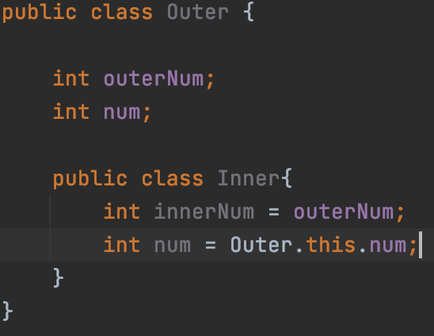
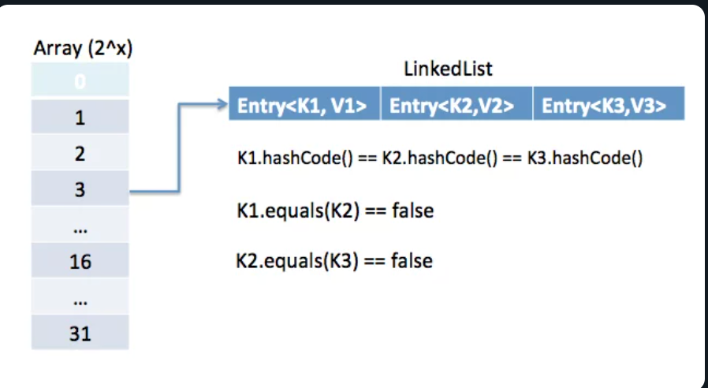

# 아이템 24. 멤버 클래스는 되도록 static으로 만들라

# 1. 중첩 클래스(nested class)란?

다른 클래스 안에 정의된 클래스로, 외부 클래스와 연관되어 있는 클래스를 중첩 클래스로 생성하며 외부클래스와 연관성이 없다면 톱레벨 클래스로 생성해야 한다.

## 1-1. 중첩 클래스(nested class) 종류

정적 멤버 클래스(static member class)를 제외한 나머지 클래스를 내부 클래스(inner class)라 한다. 내부 클래스인 이유는 외부 클래스의 인스턴스를 생성하지 않고는 인스턴스 생성이 불가하기 때문이다.

1. 정적 멤버 클래스(static member class)
2. 비정적 멤버 클래스(member class)
3. 익명 클래스(Anonymous class)
4. 지역 클래스(local class)

# 2. 정적 멤버 클래스(static member class)란?

멤버 클래스에 static이 붙은 클래스로 외부 클래스의 멤버와 메서드를 참조하지 않는다면 정적 멤버 클래스로 생성해야한다.

즉, 외부 클래스의 인스턴스와 독립적으로 존재할 수 있다면 정적 멤버 클래스로 생성해야 한다.

## 2-1. 정적 멤버 클래스 예제

흔히 외부 클래스와 함께 쓰일 때만 유용한 public 도우미 클래스로 사용된다.

```java
public class Calculator {

    public static enum Operation {
        PLUS((num1, num2) -> num1 + num2),
        MINUS((num1, num2) -> num1 - num2);

        private BiFunction<Integer, Integer, Integer> expression;

        Operation(BiFunction<Integer, Integer, Integer> expression) {
            this.expression = expression;
        }

        public int calculate(int num1, int num2){
            return expression.apply(num1,num2);
        }
    }
}

public class Main {
    public static void main(String[] args) {
        int plusCalculate = Calculator.Operation.PLUS.calculate(2, 3);
        int minusCalculate = Calculator.Operation.MINUS.calculate(2, 3);
    }
}
```

# 3. 비정적 멤버 클래스(member class)란?

멤버 클래스에 static이 붙지 않은 클래스로 외부 클래스의 멤버와 메서드를 참조한다면 멤버 클래스로 생성해야  한다.

즉, 외부 클래스의 인스턴스와 독립적으로 존재할 수 없다면 멤버 클래스로 생성해야 한다.

비정적 멤버 클래스는 외부 클래스의 인스턴스가 생성된 뒤 인스턴스를 생성할 수 있기 때문에 외부 클래스의 멤버 또는 메서드를 참조 가능하다.



> 외부 클래스의 변수 참조시 정규화된 this(**클래스명.this**)를 사용하는 것이 좋다.

## 3-1. 비정적 멤버 클래스 사용시 유의사항

비정적 멤버 클래스는 외부 클래스의 인스턴스와 숨은 참조를 가지기 때문에 외부 클래스의 인스턴스가 더이상 사용되지 않더라고 비정적 멤버 클래스의 인스턴스로 인해 GC가 되지 못해 메모리 누수가 발생할 수 있다.

## 3-2. 비정적 멤버 클래스 예제

비정적 멤버 클래스는 Adopt Patter을 정의할 때 자주 사용된다.

대표적으로 Map 인터페이스의 구현체들은 보통 (keySet, entryset, values 메서드가 반환하는) 자신의 컬렉션 뷰를 구현할 때 비정적 멤버 클래스를 사용한다. 

## 3-3. private 정적 멤버 클래스

일반 정적 멤버 클래스 처럼 외부 클래스의 멤버나 메서드를 참조하지 않으면서, 외부 클래스가 표현하는 객체의 한 부분(구성요소)를 나타낼 때 사용한다.

대표적으로 Map의 구현체에서 key-value를 표현하는 Entry 객체가 있다.

Entry는 Map의 구성요소이나 Map의 멤버나 메서드를 참조하지 않기 때문에 private 정적 멤버 클래스로 사용되는 것이다.



# 4. 익명 클래스

- 이름 그대로 이름이 없는 클래스 이며, 클래스의 선언과 객체의 생성을 동시에 하기 때문에 단 한번만 사용될 수 있는 클래스 이다.
- 람다가 등장하기 전에는 즉석에서 작은 함수 객체나 처리 객체를 만드는 데 익명 클래스를 주로 사용했으나, 이제는 람다가 그 자리를 대체했다.

# 5. 지역 클래스

외부 클래스의 메서드나 초기화블럭 안에 선언하며, 선언된 영역 내부에서만 사용될 수 있다.

## 정리

- 멤버 클래스에서 바깥 클래스의 멤버를 참조한다면 비정적으로, 그렇지 않으면 정적으로 생성하자
- 바깥 클래스의 멤버를 참조하지 않더라고, 바깥 클래스가 표현하는 객체의 한 부분(구성요소)을 나타낼 때 사용한다면 private 정적 멤버 클래스로 생성하자.