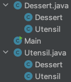
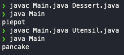

# 아이템 25. 톱레벨 클래스는 한 파일에 하나만 담으라

만약 한 파일에 톱에벨 클래스가 여러개인 파일이 있다면 소스 파일을 어떤 순서로 컴파일하느냐에 따라 동작이 달라질 수 있으므로, **한 파일에 톱레벨 클래스를 여러개 생성하지 말자.**



만약 클래스 구조가 위와 같을 때, 아래 메인클래스에서 어떤 소스 파일이 먼저 컴파일이 되냐에 따라 출력값이 전혀 달라진다.

```xml
public class Main {
    public static void main(String[] args) {
        System.out.println(Utensil.NAME + Dessert.NAME);
    }
}
```

소스 코드 컴파일 순서에 따라 전혀 다른 값이 출력된다.



# 정리

한 파일이 톱레벨 클래스는 하나만 쓰고, 굳이 한 파일에 톱레벨 클래스를 여러개 쓰고 싶다면 정적 멤버 클래스를 사용하자.