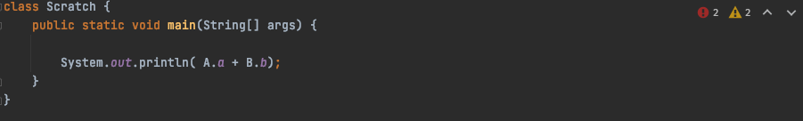
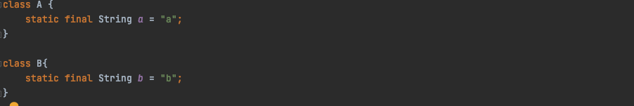
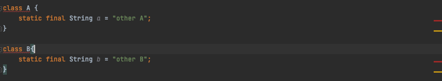

# [Item25] 톱레벨 클래스는 한 파일에 하나만 담으라

소스파일 하나에 톱레벨 클래스를 여러개 선언 가능 하다. 하지만 이런 한 방식은 이득이 없으며, 심각한 위험을 감수해야 한다. 

  심각한 위험이란 아래와 같이 

Main.java

A.java

B.java
 

A,B Class가 정의 된 A.java와  동일하게 A, B Class가 정의된 B.java가 있고 Main 함수가 있을때 

  javac [Main.java](http://main.java)  B[.java](http://a.java) 를 실행시키게 되면  B 참조보다 먼저 나오게되는 A 참조를 만나 클래스를 중복 정의 했음을 알려주게 된다. 

하지만 
 javac [Main.java](http://main.java) 또는 javac Main.java A.java로 컴파일 하게되면 "other Aother B"를 출력 하게 된다 . 

이처럼 어느 소스파일을 먼저 건네느냐에 따라서 실행 결과가 달라지게 되는데 

이를 해결 하기 위한방법은 단순히 톱레벨 클래스들을 서로 다른 소스 파일로 분리하면 그만이다!