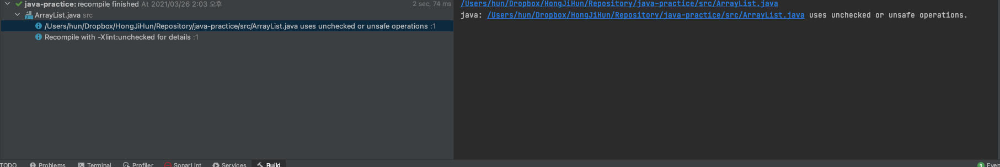
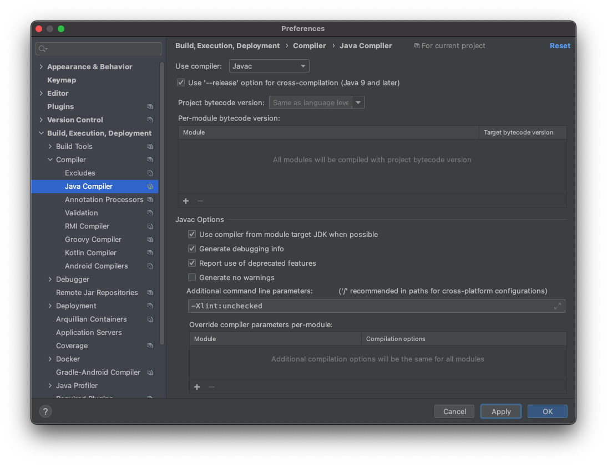
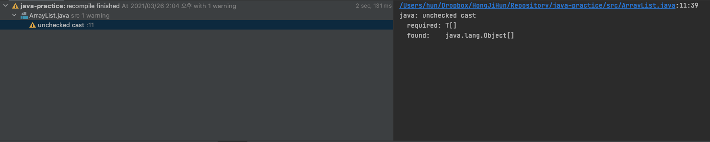

# 아이템 27. 비검사 경고를 제거하라

상태: 진행 중

아래 코드는 실제 ArrayList에 있는 코드의 일부로 컴파일 하면 비검사 경고가 표시된다.

```java
public class ArrayList {

    transient Object[] elementData; // non-private to simplify nested class access

    private int size;

    public <T> T[] toArray(T[] a) {
        if (a.length < size)
            return (T[]) Arrays.copyOf(elementData, size, a.getClass());
        System.arraycopy(elementData, 0, a, 0, size);
        if (a.length > size)
            a[size] = null;
        return a;
    }
}
```

왼쪽편 알림을 보면 비검사 경고 세부내용을 보기 위해 `-Xlint:unchecked` 옵션을 주고 다시 컴파일 하라고 한다.



Preference - Build, Execution, Deployment - Compiler - Java Complier의 Additional command line parameters에 `-Xlint:unchecked` 를 추가한다.



ArrayList를 재컴파일 하면 비검사 경고의 명확한 내용이 표시된다.



해당 경고는 이미 검증이 된 것이기 때문에 경고를 무시하기 위해 `@SuppressWarnings("unchecked")` 를 사용할 수있다.

해당 어노테이션은 선언에만 달 수 있기 때문에, 경고가 발생한 return 문에는 붙일 수가 없다.

메서드 선언에 붙일 수 있지만, 경고를 무시하는 범위가 커지므로 return 값을 담을 지역변수를 선언하고 해당 변수에 `@SuppressWarnings("unchecked")` 를 달아서 범위를 최소화 했다.

또한 왜 해당 경고를 무시해도 되는지 주석으로 남겨놔야 다른 사람이 코드를 이해하거나 수정시 문제를 발생시킬 확률이 적으므로 달아놔야 한다.

```java
public class ArrayList {

    transient Object[] elementData;

    private int size;

    public <T> T[] toArray(T[] a) {
        if (a.length < size) {
            // 생성한 배열과 매개변수로 받은 배열의 타입이 모두 T[]로 같으므로 올바른 형변환이다.
            @SuppressWarnings("unchecked")
            T[] result = (T[]) Arrays.copyOf(elementData, size, a.getClass());
            return result;
        }
        System.arraycopy(elementData, 0, a, 0, size);
        if (a.length > size)
            a[size] = null;
        return a;
    }
}
```

## 정리

할 수 있는 한 모든 비검사 경고를 제거해야 한다. 

경고를 제거할 수는 없지만 타입 안전하다고 확신할 수 있다면 @SuppressWarnings("unchecked") 애너테이션을 달아 경고를 숨기며, 왜 경고를 무시해도 되는지 주석으로 남겨야 한다.