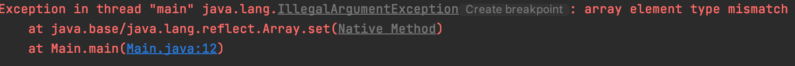
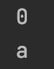
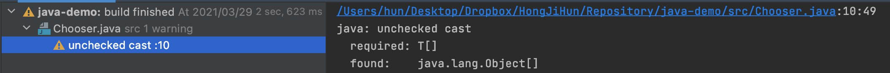

# 아이템 28. 배열보다는 리스트를 사용하라

# 1. 배열과 제네릭 타입의 차이

## 1-1. 배열은 공변(covariant)이지만 제네릭은 불공변(incovariant)이다.

Long는 Object의 Sub Type이기 때문에 컴파일시 문제가 발생하지 않는다.

다만 런타임시 잘못된 데이터타입의 데이터가 들어오면 예외가 발생한다.

```java
public class Main {
    public static void main(String[] args) {
        Object[] objects = new Long[1];
				//objects[0] = "str"; //예외 발생
    }
}
```

Long은 Object의 Sub Type이지만, List<Object>와 List<Long>의 관계는 Sub Type, Super Type이 아니기 때문에 컴파일이 되지 않는다.

```java
public class Main {
    public static void main(String[] args) {
				ArrayList<Object> objects = new ArrayList<Long>();
    }
}
```

> C# 4.0 부터는 제네릭도 공변이 가능하다고 한다.

## 1-2. 배열은 실체화(reify)된다.

배열은 runtime에도 자신이 담기로 한 원소의 타입을 인지하고 확인하지만, 제네릭은 런타임시 타입 정보가 소거 되기 때문에 리플렉션을 사용해서 다른 타입의 데이터를 저장할 수 있다.

배열은 실체화 되기 때문에 잘못된 원소가 들어올시 예외가 발생한다.

```java
public class Main {
    public static void main(String[] args) throws Exception {
        Object[] objects = new Long[1];
        Array.set(objects, 0, "a");
        Arrays.stream(objects).forEach(v -> System.out.println(v));
    }
}
```



하지만 제네릭시 소거 되기 때문에 reflection을 사용해 다른 데이터 타입의 원소가 들어가도 문제가 발생하지 않는다.

```java
public class Main {
    public static void main(String[] args) throws Exception {
        List<Integer> list = new ArrayList<>();
        list.add(0);

        Class<? extends List> arrayListClass = list.getClass();
        Method arrayListAddMethod = arrayListClass.getDeclaredMethod("add", Object.class);
        arrayListAddMethod.invoke(list,"a");

        Field elementData = arrayListClass.getDeclaredField("elementData");
        elementData.setAccessible(true);
        Object[] arrayListElementData = (Object[]) elementData.get(list);

        Arrays.stream(arrayListElementData).filter(v -> v != null).forEach(v -> System.out.println(v));
    }
}
```



# 2. 제네릭배열을 생성을 할 수 없는 이유

(4)까지 진행되고 나면 StringLists[0]에는 List<Integer>가 들어있다.

이제 (5)에서 get시 StringLists의 제네릭 타입인 String으로 형변환을 하는데, StringLists[0]번째에는 List<Integer>가 들어 있으므로 ClassCastException이 발생한다.

> 여기서 말하는 제네릭 배열 생성이란 new List<E>[], new List<String>[] 같은 것을 의미한다.

```java
public class Main {
    public static void main(String[] args) throws Exception {
        List<String>[] StringLists = new List<String>[1]; //(1)
        List<Integer> intList = List.of(42);              //(2)
        Object[] objects = StringLists;                   //(3)
        objects[0] = intList;                             //(4)
        String s = StringLists[0].get(0);                 //(5)
    }
}
```

이러한 문제가 발생하지 않으려면 (1)번에서 컴파일 오류를 발생시켜야 하기 때문에 제네릭 배열이 사용 불가능한 것이다.

# 3. 제네릭 배열 대신 리스트를 사용해야하는 이유

배열로 형변환할 때 제네릭 배열 생성 오류나 비검사 형변환 경고가 뜨는 경우 대부분은 배열인 E[] 대신 컬렉션인 List<E>를 사용하면 해결된다. 

> 배열로 형변환할 때란 return (T[]) collection.toArray(); 같은 코드를 의미한다.

 Chooser 클래스는 Collection 안의 원소 중 하나를 무작위로 선택해 반환하는 choose 메서드를 제공한다.

아래 코드의 문제점은 choose 메서드의 return type이 Object이기 때문에 해당 메서드를 사용하는 클라이언트 쪽에서는 형변환을 해줘야 하는 번거로움이 존재한다.

```java
public class Chooser {
    private final Object[] choiceArray;

    public Chooser(Collection choices) {
        this.choiceArray = choices.toArray();
    }

    public Object choose() {
        Random rnd = ThreadLocalRandom.current();
        return choiceArray[rnd.nextInt(choiceArray.length)];
    }

}
```

제네릭 배열로 변경하면 해당 메서드를 사용하는 클라이언트 쪽에서 형변환을 해줘야 하는 번거로움이 사라진다. 

```java
public class Chooser<T> {

    private final T[] choiceArray;

    public Chooser(Collection<T> choices) {
        this.choiceArray = (T[]) choices.toArray(); //비검사 형변환 경고 발생
    }

    public T choose() {
        Random rnd = ThreadLocalRandom.current();
        return choiceArray[rnd.nextInt(choiceArray.length)];
    }
}
```

다만 비검사 형변환 경고가 발생한다.

왜냐하면 런타임시 제네릭은 소거되기 때문에 컴파일러 입장에서는 무슨 타입인지 알 수 없기 때문이다.



위와 같은 비검사 형변환 경고를 제거하려면 배열 대신 List를 사용하면 된다.

이제 컴파일러 입장에서도 추론할 수 있으므로 비검사 경고가 제거된다.

```java
public class Chooser<T> {

    private final List<T> choiceList;

    public Chooser(Collection<T> choices) {
        choiceList = new ArrayList<>(choices);
    }

    public T choose() {
        Random rnd = ThreadLocalRandom.current();
        return choiceList.get(rnd.nextInt(choiceList.size()));
    }
}
```

# 정리

배열은 실체화 되기 때문에 런타임에는 Type Safe 하지만, 공변이기 때문에 컴파일 타임에는 그렇지 않다.

반대로 제네릭은 불공변이기 때문에 컴파일 타임에는 Type Safe 하지만, 런타임에는 제네릭 정보가 소거되기 때문에 Type Safe 하지 않다.

만약 제네릭과 배열을 혼합해서 쓰다가 컴파일 오류나 경고를 만나면, 가장 먼저 배열을 리스트로 대체하는 방법을 적용해보자