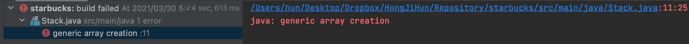
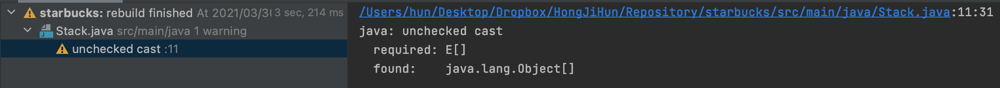
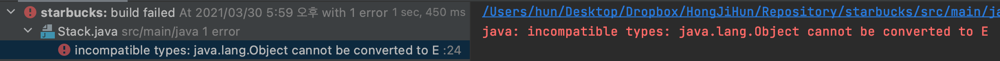
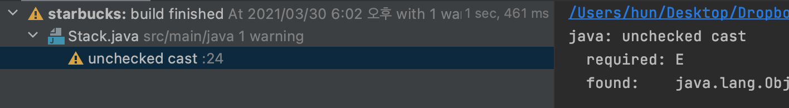

# 이펙티브 자바 - 아이템 29

# 아이템 29. 이왕이면 제네릭 타입으로 만들라

아래 코드에서 pop() 메서드 호출시 return Type이 Object이기 때문에 해당 클래스를 사용하는 클라이언트 쪽에서는 형변환이 필요하다.

잘못된 형변환은 런타임시 ClassCastException을 발생시킬 수 있기 때문에 제네릭 타입을 도입해서 캐스팅 코드 제거 및 컴파일시 타입 검증을 해주는 것이 좋다.

```java
public class Stack {

    private Object[] elements;
    private int size = 0;
    private static final int DEFAULT_INITAL_CAPACITY = 16;

    public Stack() {
        this.elements = new Object[DEFAULT_INITAL_CAPACITY];
    }

    public void push(Object e) {
        ensureCapacity();
        elements[size++] = e;
    }

    public Object pop() {
        if (size == 0){
            throw new EmptyStackException();
        }
        Object result = this.elements[size--];
        return result;
    }

    public boolean isEmpty() {
        return this.size == 0;
    }

    private void ensureCapacity() {
        if (elements.length == size) {
            elements = Arrays.copyOf(elements, 2 * size + 1);
        }
    }
}
```

# 1. 일반 클래스를 제네릭 클래스로 변경하기

## 1-1. 클래스 선언에 타입 매개 변수 추가

클래스 선언에 타입 매개 변수인 E를 추가하였으며, 코드에서 사용중인 Object를 모두 E로 변경하였다.

```java
public class Stack<E> {

    private E[] elements;
    private int size = 0;
    private static final int DEFAULT_INITAL_CAPACITY = 16;

    public Stack() {
        this.elements = new E[DEFAULT_INITAL_CAPACITY];
    }

    public void push(E e) {
        ensureCapacity();
        elements[size++] = e;
    }

    public E pop() {
        if (size == 0){
            throw new EmptyStackException();
        }
        E result = this.elements[size--];
        return result;
    }

    public boolean isEmpty() {
        return this.size == 0;
    }

    private void ensureCapacity() {
        if (elements.length == size) {
            elements = Arrays.copyOf(elements, 2 * size + 1);
        }
    }
}
```

이제 위의 코드를 컴파일 하면 아래와 코드 때문에 오류가 발생하면서 컴파일이 되지 않는다.

```java
public Stack() {
    this.elements = new E[DEFAULT_INITAL_CAPACITY];
}
```

오류가 발생하는 이유는 T, E와 같은 정규 타입 매개변수(formal type parameter)는 실체화가 불가능 하기 때문이다.



이와 같이 **배열을 사용하는 코드를 제네릭으로 만들려면 두 가지 방법**이 있다.

### 1-1-1. Object 배열을 생성한 다음 제네릭 배열로 형변환

제네릭 생성 배열을 금지하는 제약을 대놓고 우회하는 방법이다.

```java
//변경 전
public Stack() {
    this.elements = new E[DEFAULT_INITAL_CAPACITY];
}

//변경 후
public Stack() {
    this.elements = (E[]) new Object[DEFAULT_INITAL_CAPACITY];
}
```

위와 같이 코드를 변경 후 컴파일을 하면 이제 오류가 아닌 경고가 발생한다.

왜냐하면 제네릭은 런타임시 소거되기 때문에 컴파일러 입장에서는 Type Safe 한지 알 수 없기 때문이다.



컴파일러 입장에서는 Type Safe 한 지 알 수 없지만 개발자는 가능하기 때문에 Type Safe 한지 확인 후 `@SuppressWarnings` 를 사용해서 비검사 경고를 제거해 주면 된다.

```java
@SuppressWarnings("unchecked")
public Stack() {
    this.elements = (E[]) new Object[DEFAULT_INITAL_CAPACITY];
}
```

최종적인 코드는 아래와 같다.

```java
public class Stack<E> {

    private E[] elements;
    private int size = 0;
    private static final int DEFAULT_INITAL_CAPACITY = 16;

    @SuppressWarnings("unchecked")
    public Stack() {
        this.elements = (E[]) new Object[DEFAULT_INITAL_CAPACITY];
    }

    public void push(E e) {
        ensureCapacity();
        elements[size++] = e;
    }

    public E pop() {
        if (size == 0){
            throw new EmptyStackException();
        }
        E result = this.elements[size--];
        return result;
    }

    public boolean isEmpty() {
        return this.size == 0;
    }

    private void ensureCapacity() {
        if (elements.length == size) {
            elements = Arrays.copyOf(elements, 2 * size + 1);
        }
    }
}
```

### 1-1-2. elements 필드 타입을 E[]에서 Object[] 로 변경

아래와 같이 elements 필드 타입을 E[]에서 Object[]로 변경한다.

```java
public class Stack<E> {

    private Object[] elements;

}
```

이제 위의 코드를 컴파일 하면 아래와 코드 때문에 오류가 발생하면서 컴파일이 되지 않는다.

```java
public E pop() {
      if (size == 0){
          throw new EmptyStackException();
      }
      E result = this.elements[size--];
      return result;
  }
```

오류가 발생하는 이유는 Object Type을  T, E와 같은 정규 타입 매개변수(formal type parameter)로 캐스팅 할 수 없기 때문이다.



이러한 오류를 해결하기 위해 Object Type을 E로 캐스팅 해준다.

```java
public E pop() {
    if (size == 0){
        throw new EmptyStackException();
    }
    E result = (E) this.elements[size--];
    return result;
}
```

다시 컴파일을 하면 오류가 아닌 경고가 발생한다.

왜냐하면 제네릭은 런타임시 소거되기 때문에 컴파일러 입장에서는 Type Safe 한지 알 수 없기 때문이다.



컴파일러 입장에서는 Type Safe 한 지 알 수 없지만 개발자는 가능하기 때문에 Type Safe 한지 확인 후 `@SuppressWarnings` 를 사용해서 비검사 경고를 제거해 주면 된다.

```java
public E pop() {
	  if (size == 0){
	      throw new EmptyStackException();
	  }
	  @SuppressWarnings("unchecked")
	  E result = (E) this.elements[size--];
	  return result;
}
```

최종적인 코드는 아래와 같다.

```java
public class Stack<E> {

    private Object[] elements;
    private int size = 0;
    private static final int DEFAULT_INITAL_CAPACITY = 16;

    @SuppressWarnings("unchecked")
    public Stack() {
        this.elements = (E[]) new Object[DEFAULT_INITAL_CAPACITY];
    }

    public void push(E e) {
        ensureCapacity();
        elements[size++] = e;
    }

    public E pop() {
        if (size == 0){
            throw new EmptyStackException();
        }
        @SuppressWarnings("unchecked")
        E result = (E) this.elements[size--];
        return result;
    }

    public boolean isEmpty() {
        return this.size == 0;
    }

    private void ensureCapacity() {
        if (elements.length == size) {
            elements = Arrays.copyOf(elements, 2 * size + 1);
        }
    }
}
```

# 2. **배열을 사용하는 코드를 제네릭으로 만들려면 두 가지 방법의 장/단점**

각각 장점과 단점이 명확하지만, 두 번째 방법의 단점인 **배열에서 원소를 읽을 때 마다 형변환을 해줘야 한다.** 는 단점이 커서 첫 번째 방법을 많이 사용한다.

다만, 첫 번째 방법은 힙 오염이 발생할 수 있기 때문에 힙 오염이 맘에 걸린다면 두 번째 방법을 사용할 수도 있다.

> 힙 오염(Heap pollution)이란 매개 변수화된 타입의 변수가 매개 변수화 되지 않은 타입의 변수를 참조할 때 발생한다. - [Non-Reifiable Types](https://docs.oracle.com/javase/tutorial/java/generics/nonReifiableVarargsType.html) 참고

## 2-1. Object 배열을 생성한 다음 제네릭 배열로 형변환

### 2-1-1. 장점

- 배열의 타입을 E[]로 선언하여 오직 E 타입의 인스턴스만 받을 수 있음을 확실히 어플한다.
- E[]로 형변환 하는 것을 배열 생성시 한 번만 해주면 된다.

### 2-1-2. 단점

- 힙 오염(heap pollution)이 발생할 수 있다

## 2-2. elements 필드 타입을 E[]에서 Object[] 로 변경

### 2-2-1. 장점

- 힙 오염(heap pollution)이 발생하지 않는다.

### 2-2-2. 단점

- 배열에서 원소를 읽을 때 마다 형변환을 해줘야 한다.

# 정리

클라이언트에서 직접 형변환을 하게 되면 런타임시 ClassCastException을 발생시킬 수 있기 때문에 직접 형변환 해야하는 타입 보다 제네릭 타입을 쓰는 것이 좋다.