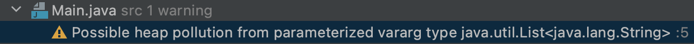
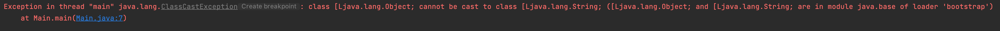
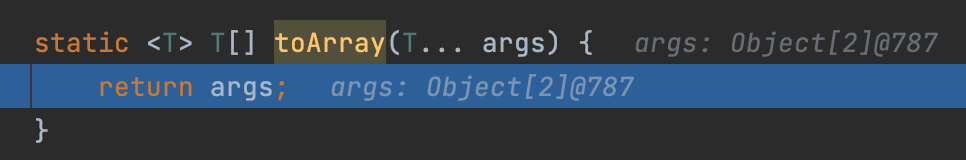

# 아이템 32. 제네릭과 가변인수를 함께 쓸 때는 신중하라

# 1. 제네릭과 가변인수를 함께 쓸 때 위험한 이유

제네릭과 가변인수를 함께 쓸 때 신중해야 하는 이유는 힙 오염(heap pollution)으로 인해 ClassCastExcption이 발생할 수 있기 때문이다.

힙 오염(heap pollution)이란 매개변수화 타입의 변수가 타입이 다른 객체를 참조하는 것이다. 예를들어 List<String>이 List<Integer>를 참조하게 되는 경우를 힙 오염이라고 한다.

```java
public class Main {

    static void dangerous(List<String>... stringLists) {
    }
}
```

위의 제네릭과 가변인수를 함께 쓴 코드를 컴파일 하면 아래와 같은 컴파일 경고가 발생한다.

컴파일 경고의 내용은 매개변수화된 vararg의 타입 java.util.List<java.lang.String>에 힙오염이 발생될 수 있다라는 경고이다.



위의 컴파일 경고의 내용대로 힙 오염을 발생시킬 수 있는 코드는 아래와 같다.

1. stringLists에는 제네릭 배열인 List<String> 배열이 생성된다.
2. Object 배열인 objects에 제네릭 배열인 stringLists를 저장한다.
3. Object 배열인 objects의 0번째에 List<Integer>를 저장하며, 이 때 힙 오염이 발생한다.
4. stringLists의 실제 타입 매개변수가 String이기 때문에 컴파일러는 String 캐스팅 코드를 추가해주는데, 이로인해 ClassCastExcption이 발생한다. 왜냐하면 3번에 의해 stringLists의 0번째에는 List<Integer>가 들어갔기 때문이다.

```java
public class Application {

    public static void main(String[] args) {
				dangerous(List.of("가"), List.of("나"));
    }

		//1
    static void dangerous(List<String>... stringLists) {
        List<Integer> integerList = List.of(42);
				//2
        Object[] objects = stringLists;
				//3
        objects[0] = integerList;
				//4
        String s = stringLists[0].get(0);
    }
}
```

이처럼 타입 안정성이 깨지니 제네릭 varargs 배열 매개변수에 값을 저장하는 것은 안전하지 않다.

> 아이템 28에서는 제네릭배열을 생성 할 수 없다고 했는데 varargs 매개변수를 받는 메서드를 선언할 수 있게 한 건 실무에서 매우 유용하기 때문이다. 실제로 JDK에는 제네릭과 가변인수를 함께 사용한 코드가 많다. `Arrays.asList(T... a)` 등....

# 2. @SafeVarargs

자바 7에서 등장한 어노테이션으로 위에서 발생한 컴파일 경고를 제거할 수 있는 어노테이션이다.

해당 어노테이션은 메서드 작성자가 해당 메서드가 타입 안전함을 보장하는 장치로, **메서드가 안전하다고 생각될 때만 사용해야 한다!!!**

# 3. 안전한 메서드 만드는 방법

varargs 매개변수 배열이 호출자로부터 그 메서드로 순수하게 인수들을 전달하는 일(varargs의 목적대로만 쓰인다면)만 한다면 그 메서드는 안전하다. 

즉, 1번의 예제코드 처럼 인수를 전달만하고 varargs 매개변수 배열에 아무것도 저장하지 않는 것이다.

하지만 이것도 타입 안전성을 깰 수 있는 예외가 있다. 바로 제네릭 varargs 매개변수 배열에 다른 메서드가 접근하는 것이다.

### 3-1. 제네릭 varargs 매개변수 배열에 다른 메서드 접근시 문제

다음 코드는 매개변수 배열을 받아서 단순히 리턴하는 코드이다.

```java
static <T> T[] toArray(T... args) {
	return args;
}
```

그리고 T 타입 인수 3개를 받아 그 중 2개를 무작위로 골라 담은 배열을 반환하는 메서를 추가하였다. 해당 메서드에서는 toArray 메서드를 호출한다.

```java
public class Main {

    static <T> T[] pickTwo(T a, T b, T c) {
        switch (ThreadLocalRandom.current().nextInt(3)) {
            case 0: return toArray(a, b);
            case 1: return toArray(a, c);
            case 2: return toArray(b, c);
        }
        throw new AssertionError();
    }

    static <T> T[] toArray(T... args) {
        return args;
    }
}
```

이제 해당 메서드를 호출해보자.

pickTwo 호출시 T는 String 타입이고, toArray의 T에도 String이 넘겨져서 String[]가 return 될 것이다.

```java
public class Main {

    public static void main(String[] args) {
        String[] attributes = pickTwo("좋은", "빠른", "가");
    }

    static <T> T[] pickTwo(T a, T b, T c) {
        switch (ThreadLocalRandom.current().nextInt(3)) {
            case 0: return toArray(a, b);
            case 1: return toArray(a, c);
            case 2: return toArray(b, c);
        }
        throw new AssertionError();
    }

    static <T> T[] toArray(T... args) {
        return args;
    }
}
```

하지만 위의 코드를 실행하면 Object를 String으로 casting 할 수 없다는 ClassCastException이 발생한다.



ClassCastException이 발생하는 이유는 toArray 메서드에서 return을 String[]이 아닌 Object[]를 리턴하기 때문이다.

toArray 메서드가 Object[]를 리턴하는 이유는 제네릭 배열 이중 타입 추론시 정규 타입 매개변수를 Object로 추론하기 때문이다.

main 메서드에서 pickTwo 메서드 호출시 제네릭 변수 T는 타입 추론이 정상적으로 되어 String이 된다. 하지만 toArray의 제네릭 변수 T는 pickTwo의 제네릭 변수이므로 Object로 타입 추론을 하기 때문에 Object[]을 리턴하는 것이다.



위의 코드에서 T[]를 List<T>로 변경하면 ClassCastException이 발생하지 않는다. 왜냐하면 배열은 실체화되기 때문에 런타임시 제네릭 타입정보를 가지나, 매개변수화 타입은 컴파일시 이미 캐스팅 정보가 결정되고, 런타임시 제네릭 소거가 되기 때문이다.

더 세부적인 내용은 [[아이템 32] toArray #88](https://github.com/Java-Bom/ReadingRecord/issues/88) 참고!!

### 3-2. 안전한 메서드

varargs 매개변수 배열이 호출자로부터 그 메서드로 순수하게 인수들을 전달하는 일(varargs의 목적대로만 쓰인다면)만 하고, 제네릭 varargs 매개변수 배열에 다른 메서드가 접근하지 않으면 안전하다!

```java
@SafeVarargs
static <T> List<T> flatten(List<? extends T>... lists) {
    List<T> result = new ArrayList<>();
    for (List<? extends T> list : lists) {
        result.addAll(list);
    }
    return result;
}
```

> varargs 매개변수를 List로 변경해서 쓰는게 좋다. 다만, 클라이언트의 코드가 살짝 지저분 해진다.

# 정리

제네릭과 가변인수와 제네릭은 기본적으로 궁합이 좋지 않다.

하지만 기능상의 이점으로 인해 허용되는 것이다.

굳이 제네릭과 가변인수를 함께 사용하고자 한다면, 해당 메서드가 타입 세이프한지 확인 후 @SafeVarargs를 달아서 경고를 제거하자