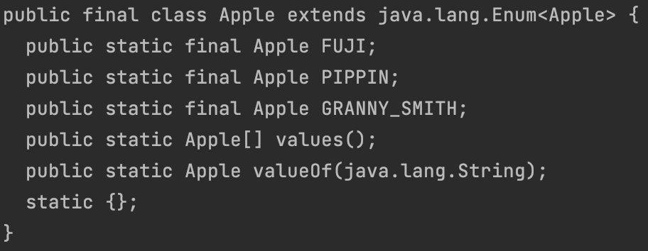
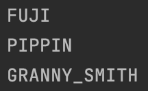
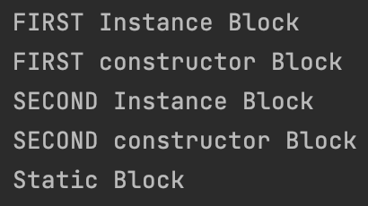

# 이펙티브 자바 - 아이템 34. int 상수 대신 열거 타입을 사용하라

# 1. 정수 열거 패턴의 문제점

1. 평범한 상수를 나열한 것뿐이라 컴파일하면 그 값이 클라이언트 파일에 그대로 새겨진다. 따라서 상수의 값이 바뀌면 클라이언트도 다시 컴파일 해야한다.
2. 정수 상수는 문자열로 출력하기가 다소 까다로우며, 상수 값 자체로는 의미 파악이 어렵다.
3. 같은 정수 열거 그룹에 속한 모든 상수를 한 바퀴 순회하는 방법도 마땅치 않다.
4. 같은 정수 열거 그룹에 상수가 몆 개인지도 알 수 없다.

# 2. 열거 타입이란?

자바의 열거 타입은 클래스이며, 상수 하나당 자신의 인스턴스를 하나씩 만들어 public static final 필드로 공개한다. 

또한 열거 타입은 밖에서 접근할 수 있는 생성자를 제공하지 않으므로 싱글턴임이 보장된다.

```java
public enum Apple {
    FUJI, PIPPIN, GRANNY_SMITH
}
```



> javap를 사용해서 클래스파일을 역어셈블할 수 있으며, 역어셈블은 클래스 파일의 내부의 기본 주고와 역어셈블코드를 확인할 수 있다.

# 3. 열거 타입 장점

## 3-1. 컴파일타임 안전성 제공

Apple 열거타입을 매개변수로 받는 메서드를 선언했다면, 건네받는 참조는 Apple의 세 가지 값중 하나임이 확실하다. 

정수 열거 패턴은 정수 타입이면 어떤 값이든 사용할 수 있기 때문에 안전하지 않다.

## 3-2. 각자의 이름공간을 가진다.

각자의 이름공간이 있어서 이름이 같은 상수도 평화롭게 공존한다.

각자의 이름공간이란 클래스명을 의미한다.

## 3-4. 새로운 상수를 추가하거나 순서를 바꿔도 다시 컴파일하지 않아도 된다.

클라이언트에 공개되는 것이 오직 필드의 이름뿐이라, 정수 열거 패턴과 달리 상수 값이 클라이언트로 컴파일되어 각인되지 않기 때문이다.

## 3-3. toString 메서드 사용시 적합한 문자열을 출력해 준다

정수 열거 패턴은 상수 값이 출력되기 때문에 의미를 파악하기 힘들지만, 열거 타입은 상수 이름을 문자열로 반환하므로 의미를 파악하기 좋다.

```java

public class Main {
    public static void main(String[] args) {
        System.out.println(Apple.FUJI.toString());
        System.out.println(Apple.PIPPIN.toString());
        System.out.println(Apple.GRANNY_SMITH.toString());
    }
}
```



# 4. 열거 타입에 메서드나 필드 추가하기

열거 타입에 있는 각 상수와 연관된 데이터나 메서드가 필요한 경우가 있는데 열거 타입도 클래스이기 때문에 필드와 메서드를 추가할 수 있다.

**열거 타입 상수 각각을 특정 데이터와 연결지으려면 생성자에서 데이터를 받아 인스턴스 필드에 저장하면 된다.**

```java
public enum Apple {
    FUJI("RED"),
    GRANNY_SMITH("GREEN");

    private final String color;

    Apple(String color) {
        this.color = color;
    }

    public String getColor() {
        return color;
    }
}
```

# 5. 상수마다 동작이 달라져야 하는 경우

switch문에서 상수값에 따라 동작이 달라지도록 처리하고 있다.

문제는 아래 코드가 깨지기 쉽다는 것이다.

예를들어 새로운 상수를 추가하면 switch에 추가되어야 한다. 만약 추가를 하지 않고 해당 상수를 넘겨준다면 `AssertionError` 가 발생한다.

```java
public enum Operation {

    PLUS, MINUS, TIMES, DIVIDE;

    public double apply(double x, double y) {
        switch (this) {
            case PLUS: return x+y;
            case MINUS: return x-y;
            case TIMES: return x*y;
            case DIVIDE: return x/y;
        }
        throw new AssertionError("알 수 없는 연산: " + this);
    }
}
```

아래 코드는 위의 코드의 단점을 보완한 것이다.

열거 타입에 추상 메서드를 선언하고 해당 추상 메서드를 각 상수별 클래스 몸체에 재정의 하였다.

이러한 방법을 상수별 메서드 구현이라 한다.

새로운 상수가 추가되어도 추상 메서드를 재정의 하지 않으면 컴파일 오류가 발생하기 때문의 위의 코드의 단점이 해결된다.

```java
public enum Operation {
    
    PLUS{public double apply(double x, double y){return x+y;}},
    MINUS{public double apply(double x, double y){return x-y;}},
    TIMES{public double apply(double x, double y){return x*y;}},
    DIVIDE{public double apply(double x, double y){return x/y;}};
    
    public abstract double apply(double x, double y);
}
```

# 6. toString 메서드를 재정의하려거든, toString이 반환하는 문자열을 해당 열거 타입 상수로 변환해주는 fromString 메서드도 함께 제공하는 걸 고려해 보자.

## 6-1. Java 8 이전

비어있는 해시맵을 만든 다음 static 초기화 블럭에서 values가 반환한 배열을 순회하며 {문자열, 열거 타입 상수} 쌍을 맵에 추가한다.

```java
public enum Operation {

    PLUS,
    MINUS,
    TIMES,
    DIVIDE;
    
    private static final Map<String, Operation> stringToEnum = new HashMap<>();
    
    static {
        for (Operation operationValue : values()) {
            stringToEnum.put(Objects.toString(operationValue), operationValue);
        }
    }

		public static Optional<Operation> fromString(String symbol) {
		        return Optional.ofNullable(stringToEnum.get(symbol));
		}
}
```

>위의 코드에서 열거 타입 상수는 생성자에서 자신의 인스턴스를 맵에 추가할 수 없다.
>
>왜냐하면 열거 타입 상수 생성자 호출시 정적 필드인 stringToEnum은 아직 초기화 되지 않았기 때문이다.
> 
>자세한 내용은 7. 열거 타입 상수 초기화 순서를 참고

## 6-2. Java 8 이후

values 메서드가 반환하는 배열 대신 스트림을 사용해서 바로 추가할 수 있다.

```java
public enum Operation {

    PLUS,
    MINUS,
    TIMES,
    DIVIDE;

    private static final Map<String, Operation> stringToEnum = Stream.of(values())
                                                                    .collect(Collectors.toMap(Objects::toString, e -> e));
    public static Optional<Operation> fromString(String symbol) {
        return Optional.ofNullable(stringToEnum.get(symbol));
    }
}
```

# 7. 열거 타입 상수 초기화 순서

열거타입의 초기화는 textual order(선언된 순서)순으로 초기화 된다.

세부적인 초기화 되는 순서는 아래와 같다.

1. 열거 타입의 상수
2. 해당 상수의 인스턴스 초기화 블럭
3. 해당 상수의 생성자
4. static field
5. static 초기화 블럭

```java
public enum EnumInitialization {

    FIRST,
    SECOND;

    private static final Map<String, EnumInitialization> stringToEnum = new HashMap<>();

    EnumInitialization() {
        System.out.println(this.name() + " constructor Block");
    }

    {
        System.out.println(this.name() + " Instance Block");
    }

    static {
        System.out.println("Static Block");
    }
}
```

상수의 순서인 FIRST, SECOND 순서로 초기화가 이루어 지며, 해당 상수들의 초기화가 완료된 뒤 static field 및 static 초기화 블럭이 호출된다.



> 멤버변수의 초기화 시기와 순서
> 
> 클래스변수의 초기화순서 : 기본값 → 명시적초기화 → 클래스 초기화 블럭
> 
> 인스턴스변수의 초기화순서 : 기본값 → 명시적초기화 → 인스턴스 초기화 블럭 → 생성자 


# 8. 전략 열거 타입 패턴

5. 상수마다 동작이 달라져야 하는 경우에서 하나의 메서드가 상수별로 다르게 동작해야 할 때 상수별 메서드 구현을 사용하는게 좋다고 하였다.

하지만, 열거 타입 상수 일부가 같은 동작을 공유한다면 상수별 메서드 구현보다 전략 열거 타입 패턴을 사용하는 것이 좋다.

전략 열거 타입 패턴이란 새로운 상수를 추가할 때 전략을 선택하도록 하는 것이다.

예를들어 아래 급여명세서에서 쓸 요일을 표현하는 열거 타입에서 직원의 (시간당) 기본 임금과 그날 일한 시간(분 단위)이 주어지면 일당을 계산해주는 pay 메서드를 가지고 있다.

해당 pay 메서드는 상수값에 따라 계산을 다르게 하고 있다.

```java
public enum PayrollDay {
    MONDAY, TUESDAY, WEDNESDAY, THURSDAY, FRIDAY, SATURDAY, SUNDAY;

    private static final int MINS_PER_SHIFT = 8 * 60;

    int pay(int minutesWorked, int payRate) {
        int basePay = minutesWorked * payRate;

        int overtimePay;

        switch (this) {
            case SATURDAY: case SUNDAY:
                overtimePay = basePay / 2;
                break;
            default:
                overtimePay = minutesWorked <= MINS_PER_SHIFT ? 0 : (minutesWorked - MINS_PER_SHIFT) * payRate / 2;
        }
        return basePay + overtimePay;
    }
}
```

위의 코드를 상수별 메서드 구현을 사용하면 아래와 같다.

1. 잔업수당을 계산하는 코드를 모든 상수에 중복해서 넣기
   
     ```java
     public enum PayrollDay {
         MONDAY{
            public int pay(int minutesWorked, int payRate) {
                 int basePay = minutesWorked * payRate;

                 int overtimePay = minutesWorked <= MINS_PER_SHIFT ? 0 : (minutesWorked - MINS_PER_SHIFT) * payRate / 2;
                 
                 return basePay + overtimePay;
                 
             }
         }, 
         TUESDAY{
             public int pay(int minutesWorked, int payRate) {
                 int basePay = minutesWorked * payRate;

                 int overtimePay = minutesWorked <= MINS_PER_SHIFT ? 0 : (minutesWorked - MINS_PER_SHIFT) * payRate / 2;

                 return basePay + overtimePay;

             }
         }, 
         WEDNESDAY{
             public int pay(int minutesWorked, int payRate) {
                 int basePay = minutesWorked * payRate;

                 int overtimePay = minutesWorked <= MINS_PER_SHIFT ? 0 : (minutesWorked - MINS_PER_SHIFT) * payRate / 2;

                 return basePay + overtimePay;

             }
         }, 
         THURSDAY{
             public int pay(int minutesWorked, int payRate) {
                 int basePay = minutesWorked * payRate;

                 int overtimePay = minutesWorked <= MINS_PER_SHIFT ? 0 : (minutesWorked - MINS_PER_SHIFT) * payRate / 2;

                 return basePay + overtimePay;

             }
         }, 
         FRIDAY{
             public int pay(int minutesWorked, int payRate) {
                 int basePay = minutesWorked * payRate;

                 int overtimePay = minutesWorked <= MINS_PER_SHIFT ? 0 : (minutesWorked - MINS_PER_SHIFT) * payRate / 2;

                 return basePay + overtimePay;

             }
         }, 
         SATURDAY{
             public int pay(int minutesWorked, int payRate) {
                 int basePay = minutesWorked * payRate;

                 int overtimePay = overtimePay = basePay / 2;

                 return basePay + overtimePay;

             }
         }, 
         SUNDAY{
             public int pay(int minutesWorked, int payRate) {
                 int basePay = minutesWorked * payRate;

                 int overtimePay = overtimePay = basePay / 2;

                 return basePay + overtimePay;

             }
         };

         public abstract int pay(int minutesWorked, int payRate);
         
         private static final int MINS_PER_SHIFT = 8 * 60;
         
     }
     ```

2. 계산 코드를 평일용과 주말용으로 나눠 각각을 도우미 메서드로 작성한 다음 각 상수가 자신에게 필요한 메서드를 적절히 호출하는 방식으로 구현할 수 있다.
   
     ```java
     public enum PayrollDay {
         MONDAY{
             public int pay(int minutesWorked, int payRate) {
                 return weekdayPay(minutesWorked, payRate);
             }
         },
         TUESDAY{
             public int pay(int minutesWorked, int payRate) {
                 return weekdayPay(minutesWorked, payRate);
             }
         },
         WEDNESDAY{
             public int pay(int minutesWorked, int payRate) {
                 return weekdayPay(minutesWorked, payRate);
             }
         },
         THURSDAY{
             public int pay(int minutesWorked, int payRate) {
                 return weekdayPay(minutesWorked, payRate);
             }
         },
         FRIDAY{
             public int pay(int minutesWorked, int payRate) {
                 return weekdayPay(minutesWorked, payRate);
             }
         },
         SATURDAY{
             public int pay(int minutesWorked, int payRate) {
                 return weekendPay(minutesWorked, payRate);
             }
         },
         SUNDAY{
             public int pay(int minutesWorked, int payRate) {
                 return weekendPay(minutesWorked, payRate);

             }
         };

         public abstract int pay(int minutesWorked, int payRate);

         private static final int MINS_PER_SHIFT = 8 * 60;

         private static int weekdayPay(int minutesWorked, int payRate) {
             int basePay = minutesWorked * payRate;

             int overtimePay = minutesWorked <= MINS_PER_SHIFT ? 0 : (minutesWorked - MINS_PER_SHIFT) * payRate / 2;

             return basePay + overtimePay;
         }

         private static int weekendPay(int minutesWorked, int payRate) {
             int basePay = minutesWorked * payRate;

             int overtimePay = overtimePay = basePay / 2;

             return basePay + overtimePay;
         }

     }
     ```

3. PayrollDay에 평일 잔업수당 계산용 메서드인 overtimePay를 구현해놓고, 주말 상수에서만 재정의해 쓰면 장황한 부분을 줄일 수 있다. 하지만 새로운 상수를 추가하면서 overtimePay 메서드를 재정의하지 않으면 평일용 코드를 그대로 물려받게 된다.

     ```java
     public enum PayrollDay {
         MONDAY,
         TUESDAY,
         WEDNESDAY,
         THURSDAY,
         FRIDAY,
         SATURDAY{
             @Override
             int overtimePay(int minutesWorked, int payRate) {
                 return super.overtimePay(minutesWorked, payRate);
             }
         },
         SUNDAY{
             @Override
             int overtimePay(int minutesWorked, int payRate) {
                 return super.overtimePay(minutesWorked, payRate);
             }
         };

         private static final int MINS_PER_SHIFT = 8 * 60;

         int pay(int minutesWorked, int payRate) {
             int basePay = minutesWorked * payRate;

             return basePay + overtimePay(minutesWorked, payRate);
         }

         int overtimePay(int minutesWorked, int payRate) {
             return minutesWorked <= MINS_PER_SHIFT ? 0 : (minutesWorked - MINS_PER_SHIFT) * payRate / 2;
         }
     }
     ```

위의 방식들 모두 코드가 장황해지고 가독성이 크게 떨어져 오류 발생 가능성이 높아진다.

위와 같은 문제는 전략 열거 타입 패턴을 사용해서 해결할 수 있다.

잔업수당 계산을 private 중첩 열거 타입(다음 코드의 PayType)으로 옮기고 PayrollDay 열거 타입의 생성자에서 이 중 적당한 것을 선택한다. 그러면 PayrollDay 열거 타입은 잔업수당 계산을 그 전략 열거 타입 에 위임하여, switch 문이나 상수별 메서드 구현이 필요 없게 된다. 이 패턴은 switch 문보다 복잡하지만 더 안전하고 유연하다.

```java
public enum PayrollDay {
    MONDAY(PayType.WEEKDAY), TUESDAY(PayType.WEEKDAY), WEDNESDAY(PayType.WEEKDAY), 
    THURSDAY(PayType.WEEKDAY), FRIDAY(PayType.WEEKDAY), 
    SATURDAY(PayType.WEEKEND), SUNDAY(PayType.WEEKEND);

    private final PayType payType;

    PayrollDay(PayType payType) {
        this.payType = payType;
    }

		public PayType getPayType() {
		        return payType;
		}

    enum PayType {
        WEEKDAY {
            int overtimePay(int minsWorked, int payRate) {
                return minsWorked <= MINS_PER_SHIFT ? 0 : (minsWorked - MINS_PER_SHIFT) * payRate / 2;
            }
        },
        WEEKEND {
            int overtimePay(int minsWorked, int payRate) {
                return minsWorked * payRate / 2;
            }
        };

        abstract int overtimePay(int mins, int payRate);
        private static final int MINS_PER_SHIFT = 8 * 60;

        int pay(int minutesWorked, int payRate) {
            int basePay = minutesWorked * payRate;

            return basePay + overtimePay(minutesWorked, payRate);
        }
    }
}
```

# 정리

필요한 원소를 컴파일타임에 다 알 수 있는 상수 집합이라면 항상 열거 타입을 사용하자