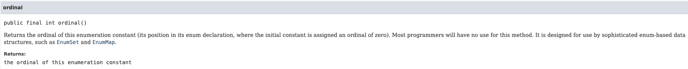

# 이펙티브 자바 - 아이템 35. ordinal 메서드 대신 인스턴스 필드를 사용하라

# 1. ordinal 메서드란?

oridinal 메서드란 열거 타입에서 해당 상수가 몆 번째 위치인지를 반환하는 메서드 이다.

> 순서는 0 부터 반환된다.

아래 열거 타입에서 ordinal 메서드를 사용하면 0 ~ 9 까지의 정수가 return 된다.

```java
public enum Ensemble {
    SOLO, DUET, TRIO, QUARTET, QUINTET, SEXTET, SEPTET, OCTET, NONET, DECTET;
}
```

# 2. ordinal 메서드 사용시 단점

## 2-1. 상수 선언을 바꾸는 순간 오작동 할 수 있다.

아래 열거 타입에서 numberOfMusicians() 메서드 호출시 SOLO는 1을 return 하고, DUET는 2를 return 한다.

```java
public enum Ensemble {
    SOLO, DUET, TRIO, QUARTET, QUINTET, SEXTET, SEPTET, OCTET, NONET, DECTET;

    public int numberOfMusicians() {
        return ordinal() + 1;
    }
}
```

하지만 DUET와 SOLO의 선언 순서를 변경 후 numberOfMusicians() 메서드를 호출하면 SOLO는 2를 return 하고, DUET는 1을 return 한다.

이처럼 단순히 선언 순서만 변경했을 뿐인데 전혀 다른 값을 return 하므로 문제가 발생할 수 있다.

## 2-2. 이미 사용 중인 정수와 값이 같은 상수는 추가할 방법이 없다.

열거 타입에는 8중주 연주를 의미하는 OCTET가 선언되어 있기 때문에 8명에서 연주하는 복4중주(double quartet)를 추가할 수 없다.

```java
public enum Ensemble {
    SOLO, DUET, TRIO, QUARTET, QUINTET, SEXTET, SEPTET, OCTET, NONET, DECTET;

    public int numberOfMusicians() {
        return ordinal() + 1;
    }
}
```

## 2-3. 값을 중간에 비워둘 수 없다.

중간에 값이 비게되면 전혀 다른 서수를 반환하기 때문에, 중간값을 더미(dummy) 상수로 채워야 한다.

# 정리

열거 타입 상수에 연결된 값은 ordinal 메서드로 얻지 말고, 인스턴스 필드에 저장하자.

```java
public enum Ensemble {
    SOLO(1), DUET(2), TRIO(3), QUARTET(4), QUINTET(5), SEXTET(6), SEPTET(7), OCTET(8), NONET(9), DECTET(10);

    private final int numberOfMusicians;

    Ensemble(int numberOfMusicians) {
        this.numberOfMusicians = numberOfMusicians;
    }
    
    public int numberOfMusicians() {
        return numberOfMusicians;
    }
}
```

[JDK 문서](https://docs.oracle.com/javase/8/docs/api/java/lang/Enum.html#ordinal--)에서 ordinal의 설명을 보면 **대부분의 프로그래머들은 이 방법을 사용하지 않을 것이다. EnumSet 및 EnumMap과 같은 정교한 열거형 기반 데이터 구조에 사용하도록 설계되었습니다.** 라고 작성되어 있다.

