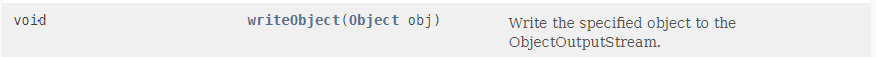

# 아이템 41. 정의하려는 것이 타입이라면 마커 인터페이스를 사용하라

## 1. 마커 인터페이스란?

아무 메서드도 담고 있지 않고, 단지 자신을 구현하는 클래스가 특정 속성을 가짐을 표시해주는 인터페이스를 뜻한다.

대표적으로 Serializable 인터페이스가 있다. Serializable 인터페이스를 구현하면, 해당 클래스의 인스턴스는 직렬화 할 수 있는 타입이라고 표시된다.

## 2. 마커 인터페이스의 장점

마커 애너테이션과 비교시 마커 인터페이스가 가지는 장점은 다음과 같다.

### 2-1. 마커 인터페이스는 이를 구현한 클래스의 인스턴스들을 구분하는 타입으로 쓸 수 있으나, 마커 애너테이션은 그렇지 않다.

마커 인터페이스는 어엿한 타입이기 때문에, 마커 애너테이션을 사용했다면 런타임에야 발견될 오류를 컴파일타임에 잡을 수 있다.

### 2-2. 적용 대상을 더 정밀하게 지정할 수 있다.

어노테이션 마커는 적용 대상(@Target)을 ElementType.TYPE으로 지정시 모든 타입(클래스, 인터페이스, 열거 타입, 애너테이션)에 사용할 수 있지만, 마커 인터페이스는 클래스 레벨에서

## 3. 마커 애너테이션의 장점

마커 인터페이스와 비교시 마커 애너테이션이 가지는 장점은 거대한 애너테이션 시스템의 지원을 받을 수 있다는 것이다.

대표적으로 스프링 프레임워크가 있다.

## 4. 언제 마커 애너테이션을 사용하고 언제 마커 인터페이스를 사용해야 할까?

- 클래스와 인터페이스 외의 프로그램 요소(모듈, 패키지, 필드, 지역변수 등)에 마킹해야 할 떄 애너테이션을 쓸 수 밖에 없다.
- 마커 인터페이스는 마킹이 된 객체를 매개변수로 받는 메서드를 작성할 일이 있을 때 사용한다. 해당 마커 인터페이스를 해당 메서드의 매개변수 타입으로 사용하여 컴파일타임에 오류를 잡아낼 수 있다.
    - ObjectOutputStream의 writeObject 메서드의 매개변수 타입으로 Serializable를 사용했다면 컴파일 타임에 오류를 잡아낼 수 있다. 하지만 Object를 받기 때문에 직렬화 불가인 객체가 들어와도 런타임때 확인이 가능하다.
        
        [https://docs.oracle.com/en/java/javase/11/docs/api/java.base/java/io/ObjectOutputStream.html](https://docs.oracle.com/en/java/javase/11/docs/api/java.base/java/io/ObjectOutputStream.html)

## 정리

마커 인터페이스와 마커 어노테이션은 모두 특정 속성을 가짐을 표시할 때 사용한다.

메서드의 매개변수 타입으로 사용한다면, 마커 인터페이스를 사용하며 그 외는 마커 어노테이션을 선택하자.