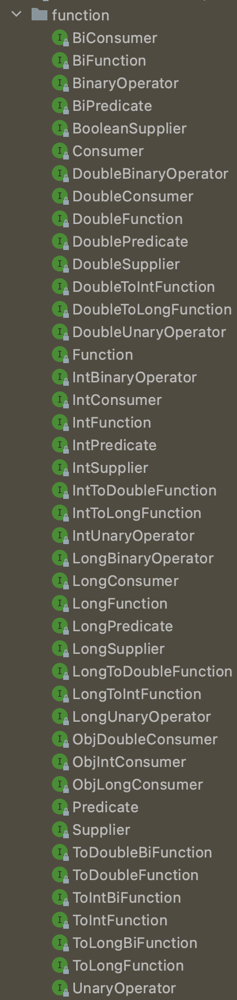

# 아이템 44. 표준 함수형 인터페이스를 사용하라

java.util.function 패키지에는 총 43개의 함수형 인터페이스가 정의되어 있으며, 아래 기본 함수형 인터페이스 6개에서 파생된 것이다.

## 기본 함수형 인터페이스(6개)

|인터페이스|함수 시그니처|예|설명|
|------|---|---|---|
| `UnaryOperator<T>` |T apply(T t)|String::toLowerCase|인수가 1개이며, 반환값과 인수의 타입이 같은 함수이다.|
| `BinaryOperator<T>` |T apply(T t1, T t2)|BigInteger::add|인수가 2개이며, 반환값과 인수의 타입이  같은 함수이다.|
| `Predicate<T>` |boolean test(T t)|Collection::isEmpty|인수 하나를 받아 boolean을 반환하는 함수이다.|
| `Function<T,R>` |R apply(T t)|Arrays:asList|인수와 반환 타입이 다른 함수이다.|
| `Supplier<T>` |T get()|Instant::now|인수를 받지 않고 값은 반환하는 함수이다.|
| `Consumer<T>` |void accept(T t)|System.out::println|인수를 하나 받고 반환값은 없는(특히 인수를 소비하는) 함수이다.|

## 기본 타입(int, long, double) 함수형 인터페이스(18개)

기본 타입 함수형 인터페이스는 기본 함수형 인터페이스 마다 기본 타입(int, long, double)이 추가된 인터페이스 이다. 기본 함수형 인터페이스 6개 * 기본 타입(int, long, double) 3개 해서 총 18개 있으며, **기본 타입 함수형 인터페이스 인수들은 각 기본 타입으로 정의**되어 있다.

기본 타입 인터페이스 명명 규칙은 **기본 타입 이름 + 기본 인터페이스 이름**이다. 예를들어 long + Function은 `LongFunction` 이며, long Type의 인수를 받아서 R을 return 하는 인터페이스이다.

## 기본 타입 변형 Function 함수형 인터페이스(9개)

Function 인터페이스에는 기본 타입을 반환하는 변형이 총 9개가 더 있다.

### 기본 타입 인수와 반환 타입을 받는 함수형 인터페이스(6개)

**인수와 리턴 타입이 모두 기본 타입**일 경우 사용하는 인터페이스로 6개가 정의되어 있다.

명명규칙은 **SrcToResult + Function(Src : 인수, Result : 반환)** 이다. 예를들어 long을 받아서 double을 리턴하면 `LongToDoubleFunction` 이다.

### 기본 타입 인수만 받는 함수형 인터페이스(3개)

**인수는 매개변수화 되어있으며, 반환 타입은 기본 타입**일 경우 사용하는 인터페이스로 3개가 정의되어 있다.

명명규칙은 **ToResult + Function(Result: 반환값)** 이다. 예를들어 인수 T를 받아서 double을 리턴하면 `ToDoubleFunction` 이다.

## 인수를 2개씩 받는 함수형 인터페이스 (9개)

### Bi + Predicate, Function, Consumer (3개)

Predicate, Function, Consumer **함수형 인터페이스에 접두어로 Bi가 붙은 것은 모두 인수를 2개씩 받는 함수형 인터페이스**이다.

### 인수를 2개씩 받고 기본 타입을 반환하는 기본 타입  BiFunction 함수형 인터페이스 (3개)

BiFunction 함수형 인터페이스는 **인수는 2개씩 받고 기본 타입(int, long, double)을 반환**하는 인터페이스 3개가 정의되어 있다.

명명규칙은 **ToResult + BiFunction(Result: 반환값)** 이다. 예를들어 인수 T, U를 받아서 double을 리턴하면 `ToDoubleBiFunction` 이다.

### 인수를 2개(객체 참조, 기본 타입)씩 받는 Consumer 함수형 인터페이스(3개)

명명규칙은 Obj + 기본 타입(int, long, double)이다. 예를들어 기본타입으로 long을 받는다면 `ObjLongConsumer` 이다.

## Supplier 함수형 인터페이스 변형(1개)

boolean을 반환하도록 한 Supplier의 변형이다.

## 기본 함수형 인터페이스 사용시 유의사항

기본 함수형 인터페이스에 박싱된 기본 타입을 넣어줄 수 있지만, 계산량이 많을 때 성능이 처참이 느려질 수 있기 때문에 사용하지 말아야 한다.

## 전용 함수형 인터페이스는 언제 만들까?

전용 함수형 인터페이스를 구현해야 할 때 아래 조건중 하나 이상을 만족해야 한다면 고민해 볼 수 있다.

1. 자주 쓰이며, 이름 자체가 용도를 명확히 설명해준다.
2. 반드시 따라야 하는 규약이 있다.
3. 유용한 디폴트 메서드를 제공할 수 있다.

대표적인 좋은 예가 Comparator 이다.

Comparator의 정의되어 있는 추상 메서드는 인자를 2개 받아서 int를 return 한다.

이는 기본 함수형 인터페이스인 ToIntBiFunction으로 대체할 수 있는데, Comparator의 같은 경우 위의 조건을 모두 만족하기 때문에 전용 함수형 인터페이스를 사용하는 것이 좋다.

## @FunctionalInterface

해당 인터페이스가 함수형 인터페이스임을 나타내는 어노테이션이다.

@FunctionalInterface 애너테이션을 사용해야 하는 이유는 다음과 같다.

1. 해당 클래스의 코드나 설명 문서를 읽을 이에게 그 인터페이스가 람다용으로 설계된 것임을 알려준다.
2. 해당 인터페이스가 추상 메서드를 오직 하나만 가지고 있어야 컴파일되게 해준다.
3. 유지보수 과정에서 누군가 실수로 메서드를 추가하지 못하게 해준다.

## 정리

입력값과 반환값에 함수형 인터페이스 타입을 활용하며, java.util.function 패키지에 정의되어 있는 표준 함수형 인터페이스를 적극 활용하자
