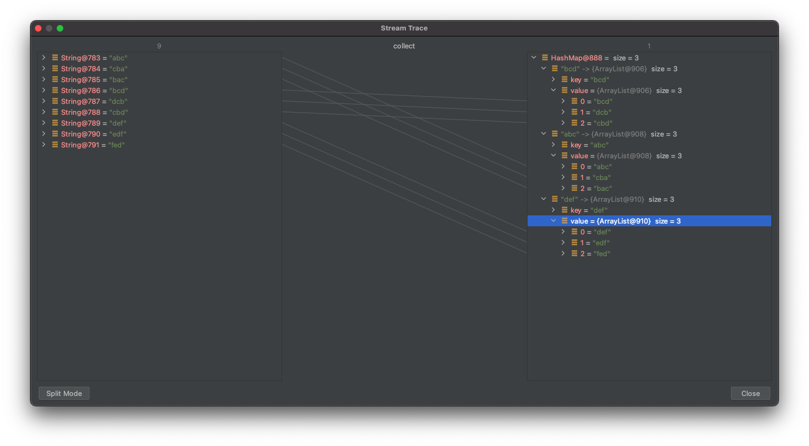
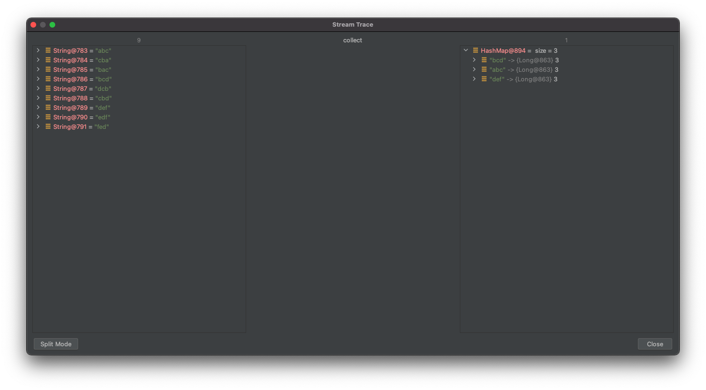
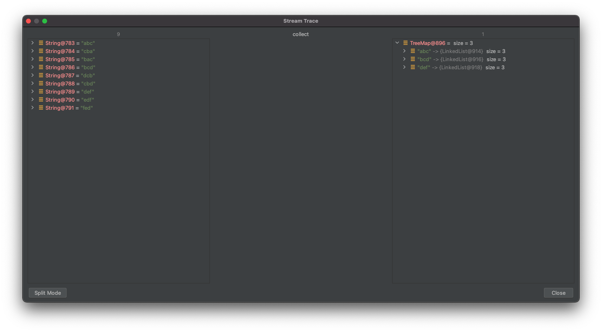
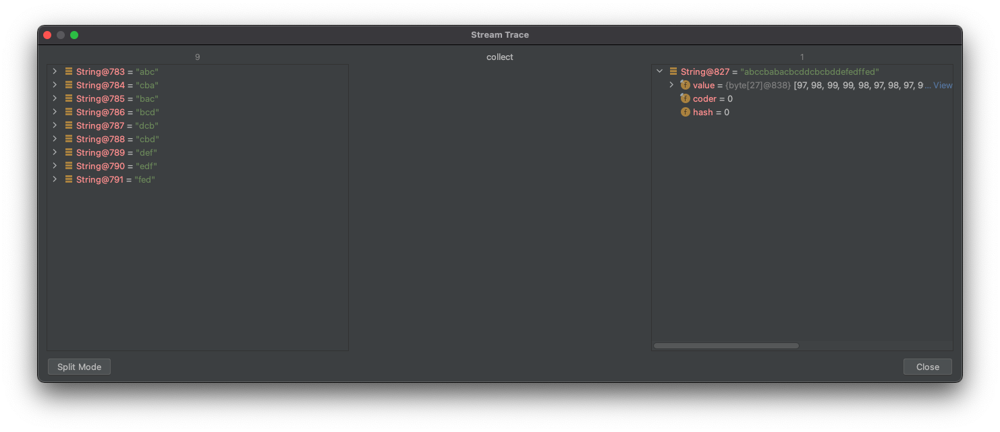
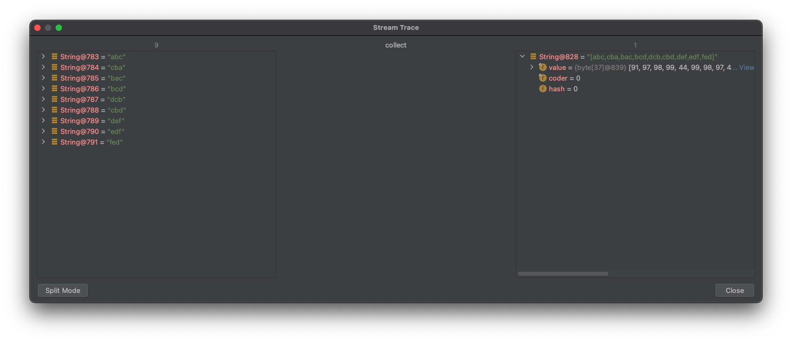

# 아이템 46. 스트림에서는 부작용 없는 함수를 사용하라

## 스트림 패러다임과 순수함수

### 스트림 패러다임

스트림 패러다임의 핵심은 계산을 일련의 변환(transformation)으로 재구성 하는 부분이다. 이때 각 변환 단계는 가능한 한 이전 단계의 결과를 받아 처리하는 순수 함수여야 한다.

### 순수함수

순수 함수란 오직 입력만이 결과에 영향을 주는 함수를 말한다. 다른 가변 상태를 참조하지 않고, 함수 스스로도 다른 상태를 변경하지 않는다.

아래 코드는 Stream은 가변 상태인 freq를 참조하고, freq의 상태를 변경하기 때문에 때문에 순수 함수가 아니다.

```java
Map<String, Lonq> freq = new HaShNap<>() ;

try (Stream<String> words = new Scanner(file).tokens()) {
	words.forEach(word -> {
		freq.merge(word.toLowerCase(), 1L, Long:sum);
	});
}
```

하지만 아래 코드는 가변 상태를 참조하고 있지 않고, 상태를 변경하지도 않기 때문에 순수 함수이다.

```java
Map<String, Long> freq;

try (Stream<String> words = new Scanner(file).tokens()){
	freq=words
		.collect(grouplngBy(String::toLowerCase, counting()));
}
```

## Collector

Collector를 사용하면 Stream의 원소를 Collection으로 모을 수 있으며 java.util.stream.Collectors에 관련 메서드들이 정의되어 있다.

> 자바 8에는 Collectors 클래스에 39개 메서드가 있으며, 자바 10에는 43개가 있다.

### toList()

Stream의 원소를 List Collection으로 만든다.

```java
public static void main(String[] args) {
	String str = "z,g,e,y,a,n,c,a,z,y";
	
	List<String> collect = Arrays.stream(str.split(","))
	                            .sorted()
	                            .distinct()
	                            .collect(Collectors.toList());
	
	collect.forEach(System.out::print);
}
```

### toMap()

Stream의 원소를 Set Collection으로 만든다.

```java
public static void main(String[] args) {
    String str = "a,b,a,b,c,a,c";
    Set<String> collect = Arrays.stream(str.split(","))
                            .collect(Collectors.toSet());

    collect.forEach(System.out::print);
}
```

**toMap(keyMapper, valueMapper)**

Stream 원소를 key에 매핑하는 함수와 value에 매핑하는 함수를 인수로 받는다.

```java
@Getter
@AllArgsConstructor
enum Expression {
    ADD("+"),
    MINUS("-");

    private String expression;
    
    public static final Map<String, Expression> stringToEnum = Arrays.stream(values())
                                                                    .collect(Collectors.toMap(Objects::toString, e -> e));
}
```

**toMap(keyMapper, valueMapper, mergeFuncation)**

1. key와 연관된 원소들 중 하나를 골라 연관 짓는 맵을 만들 때

    ```java
    @Getter
    @AllArgsConstructor
    public class Artist {

        private String name;

    }

    @Getter
    @AllArgsConstructor
    public class Album {

        private Artist artist;
        private int sales;

    }
    ```

    Artist의 앨범 중 가장 판매량이 높은 Album을 value로 사용하도록 하였다.

    ```java
    public static void main(String[] args) {
            Artist a = new Artist("a");
            Artist b = new Artist("b");
            Artist c = new Artist("c");

            List<Album> albums = List.of(
                    new Album(a, 21),
                    new Album(a, 11),
                    new Album(a, 30),
                    new Album(a, 9),
                    new Album(a, 49),
                    new Album(b, 37),
                    new Album(b, 12),
                    new Album(c, 45),
                    new Album(c, 65),
                    new Album(c, 28)
            );

            albums.stream()
                .collect(toMap(Album::getArtist, album -> album, BinaryOperator.maxBy(comparing(Album::getSales))));
            
        }
    ```

2. 충돌시 마지막 값을 취할 때

    다음 코드에서는 key가 중복되어 `IllegalStateException` 이 발생한다.

    ```java
    public class Application {

        public static void main(String[] args) {
            List<Book> books = new ArrayList<>();
            books.add(new Book("자바의정석", "교보문고"));
            books.add(new Book("자바의정석", "yes24"));

            books.stream()
                    .collect(Collectors.toMap(Book::getName, Function.identity(), (book, book2) -> book2));
        }
    }
    ```

    위의 Key 중복 문제는 병합을 하기 위한 mergeFunction을 지정해 줌으로써 해결할 수 있다.

    mergeFunction의 첫 번째 인자는 기존 값이며, 두 번째 인자는 새로운 값으로, 새로 들어온 값을 사용하도록 하였다.

    ```java
    public class Application {

        public static void main(String[] args) {
            List<Book> books = new ArrayList<>();
            books.add(new Book("자바의정석", "교보문고"));
            books.add(new Book("자바의정석", "yes24"));

    				books.stream()
                    .collect(Collectors.toMap(Book::getName, Function.identity(), ((book, book2) -> book)));
        }
    }
    ```

> 병합 함수 BinaryOperator<U> mergeFunction에서 U는 해당 Map의 Value 타입이다.

**toMap(keyMapper, valueMapper, mergeFunction, mapFactory)**

네 번째 인수로 mapFactory를 받으며, 특정 map 구현체를 직접 지정할 수 있다.

아래 코드는 key로 Album의 판매량을 받으며, 판매량 정렬을 위해 TreeMap을 사용하였다.

```java
@Getter
@AllArgsConstructor
public class Artist {

    private String name;

}

@Getter
@AllArgsConstructor
public class Album {

    private Artist artist;
    private int sales;

}

public static void main(String[] args) {
        Artist a = new Artist("a");
        Artist b = new Artist("b");
        Artist c = new Artist("c");

        List<Album> albums = List.of(
                new Album(a, 21),
                new Album(a, 11),
                new Album(a, 30),
                new Album(a, 9),
                new Album(a, 49),
                new Album(b, 37),
                new Album(b, 12),
                new Album(c, 45),
                new Album(c, 65),
                new Album(c, 28)
        );
			
							
				albums.stream()
				            .collect(toMap(Album::getSales, album -> album.getArtist(), (t, t2) -> t2 , TreeMap::new));
        
}
```

### groupingBy()

원소들을 카테고리별로 모을때 사용한다.

**groupingBy(classifier)**

입력으로 분류(classifier)를 받고 출력으로는 원소들을 카테고리별로 모아 놓은 map을 담은 수집기를 반환한다.

downstream을 지정하지 않으면, 반환된 맵에 담긴 value는 List이다.

아래코드에서 key는 애너그램 문자열이 되며, key의 value는 카테고리에 속하는 원소들을 모두 담은 리스트다.

```java
public static void main(String[] args) {

        String[] word = new String[]{"abc","cba","bac","bcd","dcb","cbd","def","edf","fed"};

        Arrays.stream(word)
                .collect(Collectors.groupingBy(s -> alphabetize(s)));

    }

    private static String alphabetize(String s) {
        char[] a = s.toCharArray();
        Arrays.sort(a);
        return new String(a);
    }
```



**groupingBy(classifier, downstream)**

downstream을 `Collectors.toCollection(LinkedList::new)` 로 지정했기 때문에 반환된 맵에 담긴 value는 LinkedList이다.

```java
public static void main(String[] args) {

        String[] word = new String[]{"abc","cba","bac","bcd","dcb","cbd","def","edf","fed"};

        Arrays.stream(word)
                .collect(Collectors.groupingBy(s -> alphabetize(s), Collectors.toCollection(LinkedList::new)));
        
    }

    private static String alphabetize(String s) {
        char[] a = s.toCharArray();
        Arrays.sort(a);
        return new String(a);
    }
```

downstream의 수집기로 counting()을 넘겨줄 수 있는데, counting()을 넘겨주면 각 카테고리(키)를 해당 카테고리의 속하는 원소의 개수(값)와 매핑한 map을 얻는다.

```java
public static void main(String[] args) {

        String[] word = new String[]{"abc","cba","bac","bcd","dcb","cbd","def","edf","fed"};

        Arrays.stream(word)
                .collect(Collectors.groupingBy(s -> alphabetize(s), Collectors.counting()));

    }

    private static String alphabetize(String s) {
        char[] a = s.toCharArray();
        Arrays.sort(a);
        return new String(a);
    }
```



**groupingBy(classifier, mapFactory, downstream)**

두 번째 인수로 mapFactory를 받으며, 특정 map 구현체를 직접 지정할 수 있다.

```java
public static void main(String[] args) {

        String[] word = new String[]{"abc","cba","bac","bcd","dcb","cbd","def","edf","fed"};

        Arrays.stream(word)
                .collect(Collectors.groupingBy(s -> alphabetize(s), TreeMap::new, Collectors.toCollection(LinkedList::new)));

    }

    private static String alphabetize(String s) {
        char[] a = s.toCharArray();
        Arrays.sort(a);
        return new String(a);
    }
```



### joining()

CharSequence 인스턴스의 스트림에만 사용할 수 있다.

**joining()**

단순히 원소들을 연결(concatenate)하는 수집기를 반환한다.

```java
public static void main(String[] args) {

        String[] word = new String[]{"abc","cba","bac","bcd","dcb","cbd","def","edf","fed"};

        Arrays.stream(word)
                .collect(Collectors.joining());

    }
```



**joining(delimiter)**

원소들 연결시 구분문자(delimiter)를 삽입한다.

```java
public static void main(String[] args) {

        String[] word = new String[]{"abc","cba","bac","bcd","dcb","cbd","def","edf","fed"};

        Arrays.stream(word)
                .collect(Collectors.joining("."));

    }
```


**joining(delimiter, prefix, suffix)**

```java
public static void main(String[] args) {

        String[] word = new String[]{"abc","cba","bac","bcd","dcb","cbd","def","edf","fed"};

        Arrays.stream(word)
                .collect(Collectors.joining("[",",","]"));

    }
```



## 정리

스트림 파이프라인 사용시 순수 함수를 사용해야 하며, 종단 연산시 Collectors에 있는 메서드를 잘 활용하자.