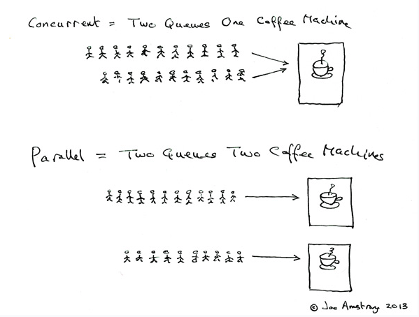

# 아이템 48. 스트림 병렬화는 주의해서 적용하라

## Concurrency(병행성)와 Paralelism(병렬성)

### Concurrency

- Single Core에서 Multi thread를 동작시키는 방식
- 실제로 처리되고 있는 작업은 하나이나 사용자 입장에서는 동시에 처리되고 있는 것으로 보인다.

### Paralelism

- Multi Core에서 Multi thread를 동작시키는 방식
- 실제로 처리되고 있는 작업이 여러개 이다.

## 병렬화가 적합하지 않은 경우

- 데이터 소스가 Stream.iterate거나 중간 연산으로 limit를 쓰면 파이프라인 병렬화로는 성능 개선을 기대할 수 없다.
- 가변 축소(mutable reduction)를 수행하는 Stream의 collect 메서드는 컬렉션들을 합치는 부담이 크기 때문에 병렬화에 적합하지 않다.

## 병렬화가 적합한 경우

- 스트림의 소스가 ArrayList, HashMap, HashSet, ConcurrentHashMap의 인스턴스거나 배열, int 범위, long 범위일 때 병렬화의 효과가 가장 좋다.해당 자료구조들은 모두 데이터를 원하는 크기로 정확하고 손쉽게 나눌 수 있어서 일을 다수의 스레드에 분배하기 좋으며, 참조 지역성(locality of reference)이 뛰어나기 때문에 CPU 유휴시간이 줄어들기 때문이다.

    > 참조 지역성이란 이웃한 원소의 참조들이 메모리에 연속해서 저장되어 있다는 뜻이다.

- 종단 연산 중 병렬화에 가장 적합한 것은 축소(reduction)다. 축소는 파이프라인에서 만들어진 모든 원소를 하나로 합치는 작업으로, Stream의 reduce 메서드 중 하나. 혹은 min, max, count, sum 같이 완성된 형태로 제공되는 메서드 중 하나를 선택해 수행 한다.

## 정리

스트림을 잘못 병렬화하면 (웅답 불가를 포함해) 성능이 나빠질 뿐만 아니라 결과 자체가 잘못되거나 예상 못한 동작이 발생할 수 있으므로 유의해야 한다. 하지만 성능개선이 필요하고, 병렬화를 위한 조건이 잘 갖춰지면 parallel 메서드 호출 하나로 거의 프로세서 코어 수에 비례하는 성능 향상을 만끽할 수 있다.