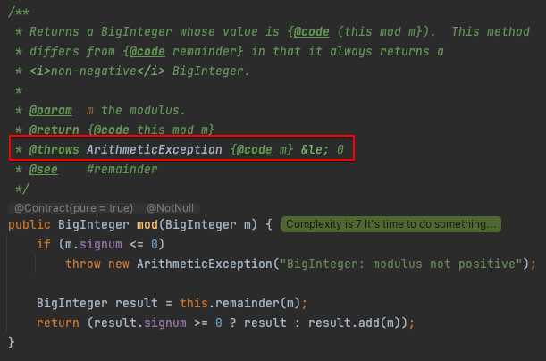

# 아이템 49. 매개변수가 유효한지 검사하라

메서드와 생성자 매개변수에 대한 제약은 반드시 문서화해야 하며 메서드 몸체가 시작되기 전에 검사해야한다.

## public/protected 메서드 매개변수 검증

public과 protected 메서드는 매개변수 값이 잘못됐을 때 던지는 예외를 문서화 해야 한다.(JavaDoc의 @throws 태그 사용) 보통 IllegalArgumentException, IndexOutOfBoundsException, NullPointerException 중 하나를 사용한다.

BigInteger.mod를 보면 @throws에 매개변수 m이 0보다 작거나 같으면 ArithmeticException가 발생한다고 문서화 되어있다.



근데 mod 메서드의 매개변수인 m은 NullPointerException이 발생할 수 있는데, 해당 설명은 메서드 설명에 없다. 해당 설명이 메서드에 없는 이유는 클래스 수준에서 기술했기 때문이다. 

클래스 수준 주석은 그 클래스의 모든 public 메서드에 적용되므로 각 메서드에 일일이 기술하는 것보다 훨씬 깔끔한 방법이다.


## public이 아닌 메서드 검증

public이 아닌 메서드라면 단언문(assert)을 사용해서 매개변수 유효성을 검증할 수 있다.

javax.lang.model.util.ElementKindVisitor6에 있는 visitPackage 메서드를 보면 e.getKind()가 PACKAGE가 아니면 AssertionError를 던진다.

```java
@Override
public R visitPackage(PackageElement e, P p) {
    assert e.getKind() == PACKAGE: "Bad kind on PackageElement";
    return defaultAction(e, p);
}
```

> java.util.concurrent.LinkedBlockingQueue에 assert가 많이 사용되었는데 거의 주석처리 되어있다.

## java.util.Objects.requireNonNull

자바 7에 추가된 메서드로 null 검사를 해주며, 예외 메세지를 지정해 줄 수도 있다.


## return 값 검증

메서드가 직접 사용하지는 않으나 나중에 쓰기 위해 저장하는 매개변수는 특히 더 신경 써서 검사해야한다.

다음 코드는 배열을 List 뷰로 변경해주는 정적 팩터리 메서드이다.

```java
static List<Integer> intArrayAsList(int[] a) {

        Objects.requireNonNull(a);

        return new AbstractList<>() {
            @Override
            public Integer get(int index) {
                return a[index];
            }

            @Override
            public Integer set(int index, Integer element) {
                int oldVal = a[index];
                a[index] = element;
                return oldVal;
            }

            @Override
            public int size() {
                return a.length;
            }
        };
    }
```

만약 매개변수인 a에 대해 null 검사를 수행하지 않고, null을 넘겨주게 되면 클라이언트가 돌려받은 List를 사용할 때 NullPointerException이 발생하게 된다.

```java
public static void main(String[] args) {
    List<Integer> list = intArrayAsList(null);
		//NPE 발생
    System.out.println(list.get(0));
}
```

## 정리

메서드나 생성자를 작성할 때 그 매개변수들에 어떤 제약이 있을지 생각해야하며, 해당 제약을 문서화 하고 몸체 시작전 검증해야 한다.