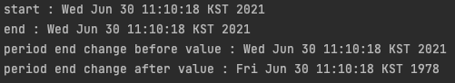
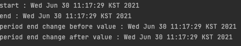
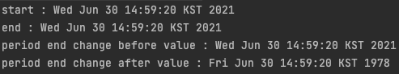
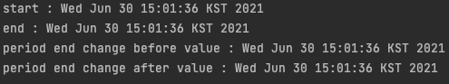

# 아이템 50. 적시에 방어적 복사본을 만들라

## 불변식이 깨지는 이유

Period 클래스는 외부에서 값을 변경할 수 있는 방법을 제공하지 않기 때문에 불변 클래스이다.

```java
public final class Period {

    private final Date start;
    private final Date end;

    public Period(Date start, Date end) {
        this.start = start;
        this.end = end;

        if (start.compareTo(end) > 0) {
            throw new IllegalArgumentException(start + "가 " + end + "보다 늦다.");
        }
    }

    public Date start() {
        return start;
    }

    public Date end() {
        return end;
    }
}
```

### 1. 생성자 파라미터가 가변 객체인 경우

하지만 다음 코드를 보면 Period의 불변식이 깨지는 것을 알 수 있다.

왜냐하면 Period의 생성자에 받는 매개변수가 가변 객체이기 때문이다.

```java
@Slf4j
public class Application {
    public static void main(String[] args) throws Exception {
        Date start = new Date();
        Date end = new Date();
        log.info("start : " + start);
        log.info("end : " + end);
        Period period = new Period(start, end);
        log.info("period end change before value : " + period.end());
        end.setYear(78);
        log.info("period end change after value : " + period.end());
    }
}
```

end의 값을 변경 후 Period 인스턴스의 end 값을 확인해 보면 변경이 되어 있는 걸 알 수 있다.



위의 문제를 해결하기 위해서는 생성자에서 받은 가변 매개변수 각각을 방어적으로 복사(defensive copy)해야 한다. 생성자를 보면 매개변수로 부터 값을 가져와 새로운 객체를 생성하고 있다.

Period의 멤버변수는 새로운 객체를 사용하기 때문에 생성자의 매개변수가 변경해도 영향을 받지 않는다.

```java
public final class Period {

    private final Date start;
    private final Date end;

    public Period(Date start, Date end) {
        this.start = new Date(start.getTime());
        this.end = new Date(end.getTime());

        if (start.compareTo(end) > 0) {
            throw new IllegalArgumentException(start + "가 " + end + "보다 늦다.");
        }
    }

    public Date start() {
        return start;
    }

    public Date end() {
        return end;
    }
}
```



### 2. 접근자 메서드로 가변 객체를 노출하는 경우

Period의 end 메서드는 가변 객체를 노출하기 때문에 값을 변경하면 Period의 불변식이 깨진다.

```java
@Slf4j
public class Application {
    public static void main(String[] args) throws Exception {
        Date start = new Date();
        Date end = new Date();
        log.info("start : " + start);
        log.info("end : " + end);
        Period period = new Period(start, end);
        log.info("period end change before value : " + period.end());
        period.end().setYear(78);
        log.info("period end change after value : " + period.end());
    }
}
```



위의 문제도 생성자 때와 동일하게 가변 필드의 방어적 복사본을 반환하면 된다.

```java
public final class Period {

    private final Date start;
    private final Date end;

    public Period(Date start, Date end) {
        this.start = new Date(start.getTime());
        this.end = new Date(end.getTime());

        if (start.compareTo(end) > 0) {
            throw new IllegalArgumentException(start + "가 " + end + "보다 늦다.");
        }
    }

    public Date start() {
        return new Date(start.getTime());
    }

    public Date end() {
        return new Date(end.getTime());
    }
}
```



## clone 사용시 유의 사항

생성자의 매개변수로 넘겨주는 매개변수가 제3자에 의해 확장될 수 있는 타입이라면 방어적 복사본을 만들 때 clone을 사용해서는 안된다.

### 1. 생성자 매개변수 clone 시

Period 생성자의 매개변수에는 Date 및 Date의 하위 타입이 들어올 수 있으므로 clone을 사용해서는 안된다.

만약 clone시 Date의 하위 타입이며 해당 인스턴스가 Period의 멤버변수에 접근할 수 있다면 불변식이 깨질 수 있다.

### 2. 접근자 메서드 clone 시

접근자 메서드에서는 타입이 확실하기 때문에 clone을 사용해도 된다.

Period의 접근자 메서드인 start와 end가 return하는 멤버변수가 Date 타입이 확실하기 때문에 문제가 없다.

## 정리

클래스가 클라이언트로부터 받는 혹은 클라이언트로 반환하는 구성요소가 가변이라면 방어적 복사를 고려해 보자. 다만, 복사 비용이 크거나 가변이 클라이언트에만 영향을 미친다면 문서화를 통해 가변시 문제가 발생할 수 있음을 명시하자