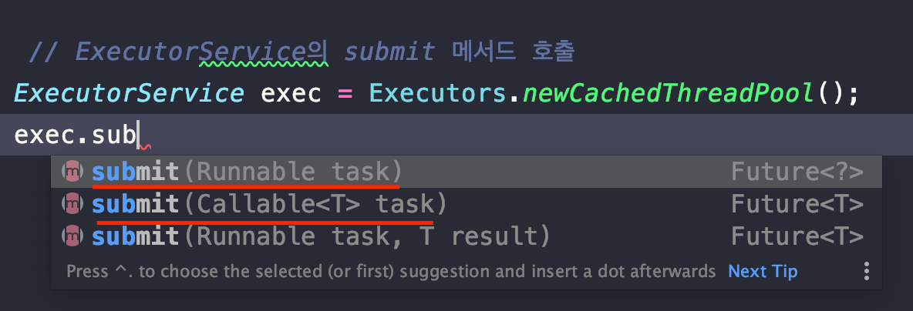

# 다중정의의 문제점

```java
public class CollectionClassifier {
    public static String classify(Set<?> s) {
        return "집합";
    }

    public static String classify(List<?> list) {
        return "리스트";
    }

    public static String classify(Collection<?> c) {
        return "그 외";
    }

     public static void main(String[] args) {
          Collection<?>[] collections = {
                  new HashSet<String>(),
                  new ArrayList<BigInteger>(),
                  new HashMap<String, String>().values()
          };

          for(Collection<?> c : collections) {
              System.out.println(classify(c));
          }
      }
}
```

이 코드는 총 3개의 메서드가 다중정의 되어 있다.

이 코드를 실행하면 

```
집합
리스트
그 외
```

가 출력이 될 것 같지만 실행하면 다른결과가 나온다.

```
그 외
그 외
그 외
```


그 이유는 classify 중 **어느 메서드를 호출할지가 컴파일타임에 정해지기 때문이다.** 

컴파일타임에는 for 문 안의 c는 항상 Collection 타입이다.

**런타임 시에는 타입이 매번 달라지만, 호출할 메서드를 선택하는 데는 영향을 주지 못한다.**

이처럼 직관과 어긋나는 이유는 **재정의한 메서드는 동적으로 선택되고, 다중정의한 메서드는 정적으로 선택 되기 때문이다.**

**CollectionClassifier** 클래스의 목적은 매개변수의 런타임 타입에 따라 적절한 다중정의 메서드로 자동 분배 하는 것이였다.

정상적으로 동작하려면 CollectionClassifier의 classify 메서드를 하나로 합친 후 `instanceof` 로 명시적 검사하면 말끔히 해결 된다.

```java
public static String classify(Collection<?> c) {
  return c instanceof Set ? "집합" : 
  c instanceof List ? "리스트" : "그 외";
}
```


# 다중정의는 사용하지 말자

- API 사용자가 매개변수를 넘기면서 어떤 다중정의 메서드가 호출될지 모른다면 오동작 하기 쉽다.
  - 런타임에 이상하게 행동할 것이며 API 사용자들은 문제를 진단하느라 긴 시간을 허비할 것이다.
- 가변인수를 사용하는 메서드라면 다중정의를 아예 하지 말아야 한다.
  - **다중정의 하는 대신 메서드 이름을 다르게 지어주자**


## ObjectOutputStream

`ObjectOutputStream.wrtie()` 메서드는 모든 기본 타입과 일부 참조 타입용 변형을 갖고 있다.

그런데 다중정의가 아닌, 모든 메서드에 다른 이름을 지어주는걸 선택 했다.

- writeBoolean(boolean)
- writeInt(int)
- writeLong(long)

이런 방식의 장점은 read 메서드의 이름과 짝을 맞춰 줄 수 있다.

- readBoolean()
- readInt()
- readLong()


# 기본타입과 오토박싱

```java
public class SetList {
     public static void main(String[] args) {
         Set<Integer> set = new TreeSet<>();
         List<Integer> list = new ArrayList<>();

         for(int i = -3; i < 3; i++) {
             set.add(i);
             list.add(i);
         }

         for(int i = 0; i < 3; i++) {
             set.remove(i);
             list.remove(i);
         }

         System.out.println(set + " " + list);
      }
}

```

이 코드를 실행하면

```
[-3, -2, -1] [-3, -2, -1]
```

가 나올 것 같지만 실제로는 다음의 결과가 나온다.

```
[-3, -2, -1] [-2, 0, 2]
```

그 이유는 List.remove()가 다중 정의가 되어 있기 때문이다.

- **E remove(int index);**
- **boolean remove(Object o);**

원래  모든 기본 타입이 모든 참조 타입과 근본적으로 달랐지만, 오토박싱이 도입되면서 같아지게 되었다.


# 메서드 참조

```java
// Thread 생성자 호출
new Thread(System.out::println).start();

// ExecutorService의 submit 메서드 호출
ExecutorService exec = Executors.newCachedThreadPool();
//컴파일 에러
exec.submit(System.out::println);
```

- Thread의 생성자는 Runnable을 인자로 받는다.
- ExecutorService.submit()의 메서드는 Runnable을 인자로 받는다.

하지만 exec.submit에서 컴파일 에러가 난다.

그 이유는 submit의 다중정의 메서드 중에 Callable<T\> 를 받는 메서드가 있어서 컴파일러가 어떤걸 사용할지 모르는 것이다.



다중정의된 메서드들이 함수형 인터페이스를 인수로 받을 때, 비록 서로 다른 함수형 인터페이스라도 인수 위치가 같으면 혼란이 생긴다.

그러므로 메서드를 다중정의할 때, 서로 다른 함수형 인터페이스라도 같은 위치의 인수로 받아서는 안 된다.


# String 클래스의 다중정의

String은 자바 4 시절부터 `contentEquals(StringBuffer)` 메서드를 가지고 있었다.

그런데 자바 5에서 StringBuffer, StringBuilder, String, CharBuffer 등의 비슷한 부류의 타입을 위한 **공통 인터페이스로** CharSequence가 등장했고, 자연스럽게 String에도 CharSequence를 받은 contentEquals가 다중정의 되었다.

하지만 이 두 메서드는 같은 객체를 입력하면 완전히 같은 작업을 해주니 해로울 건 전혀 없다.

이처럼 어떤 다중정의 메서드가 불리는지 몰라도 기능이 똑같다면 신경쓸게 없다. 

이렇게 하는 가장 일반적인 방법은 상대적으로 더 특수한 다중정의 메서드에서 덜 특수한 다중정의 메서드로 일을 넘겨버리는 것이다.

```java
public boolean contentEquals(StringBuffer sb) {
  return contentEquals((CharSequence)sb);
}
```


## String.valueOf()

하지만 String 클래스의 valueOf(char[])과 valueOf(Object) 는 **같은 객체를 건네더라도 전혀 다른 일을 수행한다.**

이렇게 해야 할 이유가 없었음에도, 혼란을 불러 올 수 있는 잘못된 사례로 남게 되었다.

