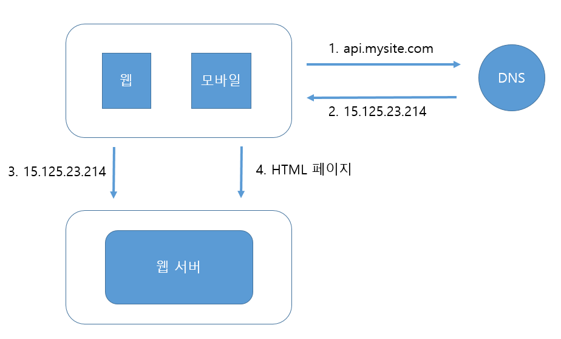
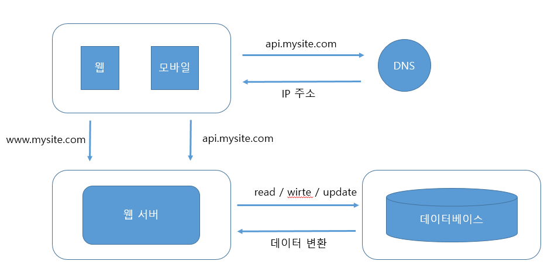
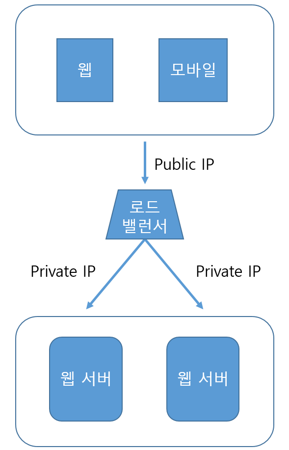
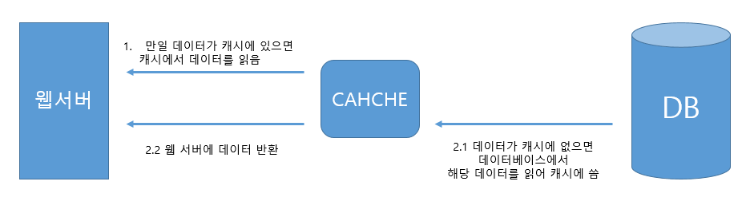
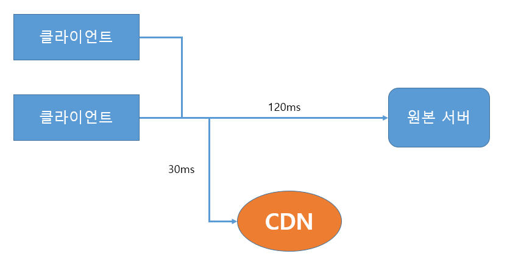
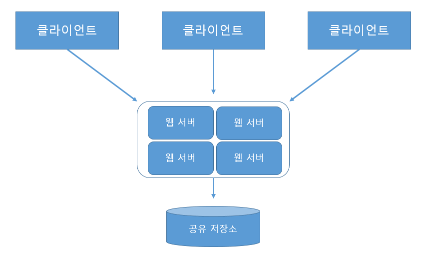
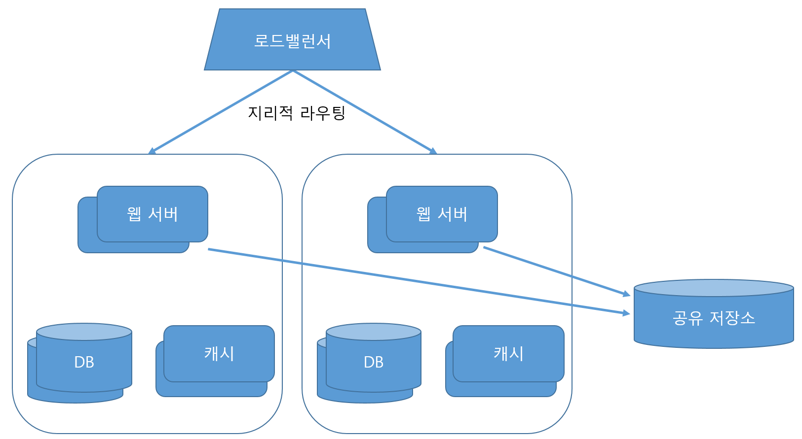

# 사용자 수에 따른 규모 확장성

 

해당 장에서는 한 명의 사용자를 지원하는 시스템에서 몇백만 사용자를 지원하는 시스템까지 훑어본다.

 

## 단일 서버

단일 서버는 웹, 앱, 데이터베이스, 캐시 등이 하나의 서버에서 실행하는 경우를 말한다.

사용자 요청 처리 흐름은 다음과 같다.

1. 사용자가 도메인 이름을 입력하여 웹사이트에 접속한다.
2. DNS 조회 결과로 IP 주소가 반환된다. (DNS 는 외부 서비스이다)
3. 해당 IP 주소로 HTTP(HyperText Transfer Protocol) 요청이 전달된다.
4. 요청을 받은 웹 서버는 HTML 페이지나 JSON 형태의 응답을 반환한다.

- 단말기 요청 종류
    - 웹 애플리케이션 : 비즈니스 로직, 데이터 저장 등을 처리하기 위한 서버, 프레젠테이션 위한 클라이언트로 구분한다.
    - 모바일 앱 : 웹 서버와 통신 위한 HTTP 프로토콜을 사용하고 보통 응답 데이터로는 JSON 을 사용한다.

 

## 데이터 베이스

서버 하나로는 충분하지 않기에 데이터베이스용으로 서버를 분리할 수 있다.

해당 예시는 웹/모바일 트래픽 처리 서버 (웹 계층)  와 데이터베이스 서버 (데이터 계층)으로 확장한 형태이다.

데이터베이스 종류로는 관계형 데이터베이스와 비관계형 데이터베이스가 있으며

비관계형 데이터 베이스를 선택을 고려해야하는 상황은 다음과 같다.

- 아주 낮은 응답 지연시간(latency)이 요구됨
- 다루는 데이터가 비정형(unstructured) 이라 관계형 데이터가 아님
- 데이터(JSON, YAML, XML 등)를 직렬화하거나 (serialize) 역직렬화(deserialize) 할 수 있기만 하면됨
- 아주 많은 양의 데이터를 저장할 필요가 있음

 

## 수직적 규모 확장 vs 수평적 규모 확장

- 수직적 규모 확장
    - 스케일업(scale up)
    - 서버에 고사양 자원 (더 좋은 cpu, 더 많은 ram) 을 추가하는 행위
    - 장점 : 트래픽 양이 적을때 단순한 방법
    - 단점 : 확장에 한계가 있으며 장애 발생시 서버가 중단되는 상태 발생함
- 수평적 규모 확장
    - 스케일 아웃(scale out)
    - **더 많은 서버를 추가**하여 성능을 개선하는 행위

 

### 로드밸런서

로드밸런서는 위에서 본 웹서버에 수많은 사용자가 접근했을때 장애 상황을 해결하기 위해 도입할 수 있는 방법이다.

로드밸런서를 사용함으로 인한 장점은 다음과 같다.

- 장애를 자동복구 할 수 있다.
- 웹 계층의 가용성이 향상된다.
    - 부하 분담을 위한 서버 추가가 용이하다.
    - 자동 트래픽 분산으로 트래픽 감당이 가능하다.

 

### 데이터베이스 다중화

웹계층의 가용성이 증가를 위해 로드밸런서를 적용 했다면 데이터 계층의 개선은 데이터베이스 다중화를 통해 개선할 수 있다.

보통 데이터베이스 다중화는 서버 사이에 주(master) - 부(slave) 관계를 설정하여 설계한다.

- 주(master) 데이터베이스 서버
    - 쓰기 연산을 주로 수행하며 부(slave) 에 데이터에 사본을 전달한다.
    - insert, delete, update 명령을 받아 수행한다.
- 부(slave) 데이터베이스 서버
    - 읽기 연산만을 수행한다. (대부분 애플리케이션은 읽기 연산 비중이 훨씬 높다)
    - 주 데이터베이스의 수보다 많게 구성한다.

해당 구조를 통해서 더 나은 성능, 안정성, 가용성을 개선 할 수 있다.

 

## 캐시

웹계층 개선은 로드밸런서, 데이터계층 개선은 데이터베이스 다중화 이며 **응답 시간**의 개선은 캐시로 개선할 수 있다.

 

### 캐시 계층

캐시 계층은 데이터가 잠시 보관되는 곳으로 데이터베이스보다 훨씬 빠른 장점이 있다.

대부분 캐시 서버들이 일반적으로 널리 쓰이는 프로그래밍 언어로 API 를 제공한다.

다음은 **읽기 주도형 캐시 전략** 이다.

- 캐시 사용시 유의할 점
    - 데이터 갱신은 자주 일어나지 않고 참조는 빈번하고 일어나는가?
    - 중요한 데이터를 휘발성 캐시에 저장해도 되는가?
    - 일관성 유지, 데이터 저장소 원본과 캐시 내 사본의 유지는 어떻게 할 것인가?
    - 장애에 대한 대처는?
    - 캐시 메모리 크기는?
    - 캐시가 가득찼을때 데이터 방출 정책은 어떻게 되는가?
        - LRU 마지막으로 사용된 시점이 오래된 데이터 방출
        - LFU 사용된 빈도 낮은 데이터 방출
        - FIFO 먼저들어온 데이터 순서로 방출

 

## 콘텐츠 전송 네트워크(CDN)

CDN 은 정적 콘텐츠를 전송하는 데 쓰이는, 지리적으로 분산된 서버의 네트워크이다. 이미지, 비디오, CSS, JavaScript 파일 등을 캐시할 수 있다.

> 해당 내용에서는 정적 콘텐츠를 캐시하는 방법만 설명한다.

사용자 (클라이언트) 가 CDN 서비스 사업자가 제공한 url을 통해 이미지 파일에 접근한다고 가정했을 때,

CDN 서버에 캐시되어 있는 이미지를 클라이언트에 전달한다.

만일 CDN 서버의 캐시에 해당 이미지가 없을 경우 원본 서버에서 요청하여 파일을 가져와 클라이언트에 전달한다.

CDN 사용시 고려해야할 점은 다음과 같다.

- CDN 사업자 (third-party) 에게 내는 비용은 합리적인가?
- 콘텐츠의 만료 시점은?
- CDN 자체가 죽었을 경우 어떻게 대비하는가?
- 콘텐츠 무효화 방법은 어떻게 할 것인가? (새로운 콘텐츠 캐싱)

 

## 무상태 (stateless) 웹 계층

웹 계층을 **수평적**으로 확장하는 방법으로 제시되는 방법이다.

상태 정보(사용자 세션 같은 데이터) 를 웹 계층에서 제거 해야하는데 이유는 다음과 같다.

각기 다른 서버에 사용자 세션이 각기 다르게 저장이 되어 있을때 특정 사용자에 대한 인증 요청은 하나의 서버에 의존적이게 되는데 이때 문제는 같은 클라이언트로부터의 요청은 항상 같은 서버로 전송되게 된다는 점이다.

따라서 무상태 아키텍처를 적용해야한다.

공유 저장소는 관계형 데이터베이스 일 수도 있고, Memcached/Redis 같은 캐시 시스템일 수 도 있고, NoSQL 일 수도 있다.

책에서는 NoSQL 을 표현했는데 NoSQL 의 장점으로 규모확장이 편하다는 점을 들었다.

 

## 데이터 센터

다음은 두 개의 데이터 센터를 이용하는 사례이다.

장애가 없는 상황에서 사용자는 가장 가까운 데이터 센터로 안내되며 이를 지리적 라우팅(geoDNS-routing 또는 geo-routing) 이라고 한다.

데이터 센터 중 하나에 심각한 장애가 발생하면 모든 트래픽은 장애가 없는 데이터 센터로 전송 된다.

데이터 센터 아키텍처를 만들기 위해 몇 가지 기술적 난제를 해결해야 한다.

- 트래픽 우회 : 올바른 데이터 센터로 트래픽을 보내는 효과적인 방법을 찾아야한다.
- 데이터 동기화 : 데이터 센터마다 별도의 데이터베이스를 사용하고 있는 상황에 장애 발생시 누락되는 데이터가 없어야 된다.
- 테스트와 배포 : 여러 데이터 센터를 사용한다면 웹 사이트 또는 애플리케이션을 여러 위치에서 테스트 해보며, 자동화 배포 도구는 동일하게 설치되었는가 확인해야한다.

 

## 메시지 큐

시스템을 더 큰 규모로 확장하기 위해서는 시스템의 컴포넌트를 분리하여 각기 독립적으로 확장될 수 있도록 해야한다.

메시지 큐는 많은 실제 분산 시스템이 이 문제를 풀기 위해 채용하고 있는 핵심적 전략 중 하나이다.

메시지 큐의 특징은 다음과 같다.

- 메시지의 무손실(즉, 메시지 큐에 일단 보관된 메시지는 소비자가 꺼낼 때까지 안전히 보관된다는 특성) 을 지원하는 컴포넌트
- 메시지의 버퍼 역할
- 비동기적으로 전송

메시지 큐를 이용하면 서비스 또는 서버 간 결합이 느슨해져서, 규모 확장성이 보장되어야 하는 안정적 애플리케이션을 구성하기 좋다.

생산자는 소비자 프로세스가 다운되어 있어도 메시지를 발행할 수 있고, 소비자는 생산자 서비스가 가용한 상태가 아니더라도 메시지를 수신할 수 있다.

 

## 로그, 메트릭 그리고 자동화

웹 사이트와 할께 사업 규모가 커지면 다음 도구에 필수적으로 투자해야 한다.

- 로그 : 에러 로그를 모니터링 하는 것은 중요하다. 로그를 단일 서비스로 모아주는 도구를 활용할 수도 있다.
- 메트릭 : 사업 현황에 유용한 정보를 얻을 수 있는 몇가지는 다음과 같다.
    - 호스트 단위 메트릭 : CPU, 메모리, 디스크 I/O 에 관한 메트릭
    - 종합(aggregated) 메트릭 : 데이터베이스 계층의 성능, 캐시 계층의 성능 같은 것
    - 핵심 비즈니스 메트릭 : 일별 능동 사용자, 수익, 재방문 등

 

## 데이터베이스의 규모 확장

저장할 데이터가 많아져 데이터베이스를 증설해야할 때 다음 두가지 방법이 있다.

### 수직적 확장

스케일 업이라고도 부르는 이방법은 기존 서버에 더 많은, 또는 고성능의 자원을 증설하는 방법이다.

스택오버플로는 2013년 한 해 동안 방문한 천만 명의 사용자 전부를 단 한 대의 마스터 데이터베이스로 처리하였다.

하지만 단점으로는 다음이 존재한다.

- 데이터베이스 서버 하드웨어는 한계가 있으므로 무한 증설할 수 없다.
- SPOF(Single Point of Failure) 로 인한 위험성이 크다.
- 비용이 많이 든다.

### 수평적 확장

데이터베이스의 수평적 확장은 **샤딩(sharding)** 이라고도 부르며 더 많은 서버를 추가함으로써 성능 향상을 한다.

샤딩은 대규모 데이터베이스를 샤드(shard) 라고 부르는 작은 단위로 분할하는 기술을 일컫는다.

> 모든 샤드는 같은 스키마를 쓰지만 샤드에 보관되는 데이터 사이에는 중복이 없다.

샤드 전략에서 가장 중요한 것은 샤딩 키(sharding key) 를 어떻게 정하느냐 이다.

샤딩키는 파티션 키 (partition key) 라고도 부르는데 데이터를 어떻게 분산할지 정하는 기준이 된다.

샤딩을 도입하면 다음 문제를 고려해야한다.

- 데이터의 재 샤딩(resharding) : 샤드를 추가할 때 샤드 키를 계산하는 함수를 어떻게 변경할 것인가? -> 안정 해시 기법을 활용(5장)
- 유명인사(celebrity) 문제 : 핫스팟 키 (hotspot key) 문제라고도 하며 특정 샤드에 질의가 집중되어 서버에 과부하가 걸리는 문제
- 조인과 비정규화(join and de-normalization) : 일단 샤드서버로 쪼갠 데이터베이스는 여러 데이터를 조인하기가 힘들어진다.
    - 해당 해결 방법으로는 데이터베이스를 비정규화하여 하나의 테이블에서 질의가 수행될 수 있도록 하는것이 있다.

 

## 백만 사용자, 그리고 그 이상

시스템의 규모를 확장하는 것은 지속적이고 반복적(iterative) 인 과정이다.

지금까지 살펴본 기법들을 반복해서 최적화 해야할 것이다.

- 웹 계층은 무상태 계층으로
- 모든 계층에 다중화 도입
- 가능한 한 많은 데이터를 캐시할 것
- 여러 데이터 센터를 지원할 것
- 정적 콘텐츠는 CDN 을 통해 서비스할 것
- 데이터 계층은 샤딩을 통해 그 규모를 확장할 것
- 각 계층은 독립적 서비스로 분할 할 것
- 시스템을 지속적으로 모니터링하고, 자동화 도구들을 활용할 것

 

더 나아가 수백만 사용자를 지원하는 시스템을 만들려면 새로운 전략이 필요할 수도 있다.

예를들어 시스템을 최적화하고 더 작은 단위의 서비스로 분할하기 처럼 말이다.

